Colour Science for Python
=========================

..  image:: https://raw.githubusercontent.com/colour-science/colour-branding/master/images/Colour_Logo_Medium_001.png

.. start-badges

|gitter| |travis| |azure| |coveralls| |codacy| |version| |zenodo|

.. |gitter| image:: https://img.shields.io/gitter/room/colour-science/colour.svg?style=flat-square
    :target: https://gitter.im/colour-science/colour/
    :alt: Gitter
.. |travis| image:: https://img.shields.io/travis/colour-science/colour/develop.svg?label=travis-ci+build&style=flat-square
    :target: https://travis-ci.org/colour-science/colour
    :alt: Develop Build Status
.. |azure| image:: https://img.shields.io/vso/build/colour-science/b0916647-91be-4025-951a-d791f64f3b96/1.svg?label=azure+build&style=flat-square
    :target: https://dev.azure.com/colour-science/Colour/_build?definitionId=1 
    :alt: Azure DevOps
.. |coveralls| image:: http://img.shields.io/coveralls/colour-science/colour/develop.svg?style=flat-square
    :target: https://coveralls.io/r/colour-science/colour
    :alt: Coverage Status
.. |codacy| image:: https://img.shields.io/codacy/grade/7d0d61f8e7294533b27ae00ee6f50fb2/develop.svg?style=flat-square
    :target: https://www.codacy.com/app/colour-science/colour
    :alt: Code Grade
.. |version| image:: https://img.shields.io/pypi/v/colour-science.svg?style=flat-square
    :target: https://pypi.python.org/pypi/colour-science
    :alt: Package Version
.. |zenodo| image:: https://img.shields.io/badge/DOI-10.5281/zenodo.2604314-blue.svg?style=flat-square
    :target: https://dx.doi.org/10.5281/zenodo.2604314
    :alt: DOI

.. end-badges

`Colour <https://github.com/colour-science/colour>`_ is a
`Python <https://www.python.org/>`_ colour science package implementing a
comprehensive number of colour theory transformations and algorithms.

It is open source and freely available under the
`New BSD License <http://opensource.org/licenses/BSD-3-Clause>`_ terms.

Draft Release Notes
-------------------

The draft release notes from the
`develop <https://github.com/colour-science/colour/tree/develop>`_
branch are available at this
`url <https://gist.github.com/KelSolaar/4a6ebe9ec3d389f0934b154fec8df51d>`_.

Features
--------

`Colour <https://github.com/colour-science/colour>`_ features a rich dataset
and collection of objects, please see the
`features <https://www.colour-science.org/features/>`_ page for more
information.

Installation
------------

`Anaconda <https://www.continuum.io/downloads>`_ from *Continuum Analytics*
is the Python distribution we use to develop **Colour**:
it ships all the scientific dependencies we require and is easily deployed
cross-platform:

.. code-block:: bash

    $ conda create -y -n python-colour
    $ source activate python-colour
    $ conda install -y -c conda-forge colour-science

**Colour** can be easily installed from the `Python Package Index <https://pypi.python.org/pypi/colour-science/>`_ by issuing this command in a shell:

.. code-block:: bash

    $ pip install colour-science

The detailed installation procedure is described in the
`Installation Guide <https://www.colour-science.org/installation-guide/>`_.

Usage
-----

The two main references for `Colour <https://github.com/colour-science/colour>`_
usage are the `Colour Manual <https://colour.readthedocs.io/en/latest/manual.html>`_
and the `Jupyter Notebooks <http://nbviewer.jupyter.org/github/colour-science/colour-notebooks/blob/master/notebooks/colour.ipynb>`_
with detailed historical and theoretical context and images:

-   `Colour Manual <https://colour.readthedocs.io/en/latest/manual.html>`_
-   `Jupyter Notebooks <http://nbviewer.jupyter.org/github/colour-science/colour-notebooks/blob/master/notebooks/colour.ipynb>`_

Examples
~~~~~~~~

Most of the objects are available from the **colour** namespace:

.. code-block:: python

    >>> import colour

Chromatic Adaptation
^^^^^^^^^^^^^^^^^^^^

.. code-block:: python

    >>> XYZ = [0.20654008, 0.12197225, 0.05136952]
    >>> D65 = colour.ILLUMINANTS['CIE 1931 2 Degree Standard Observer']['D65']
    >>> A = colour.ILLUMINANTS['CIE 1931 2 Degree Standard Observer']['A']
    >>> colour.chromatic_adaptation(
    ...     XYZ, colour.xy_to_XYZ(D65), colour.xy_to_XYZ(A))
    array([ 0.2533053 ,  0.13765138,  0.01543307])
    >>> sorted(colour.CHROMATIC_ADAPTATION_METHODS.keys())
    ['CIE 1994', 'CMCCAT2000', 'Fairchild 1990', 'Von Kries']

Algebra
^^^^^^^

Kernel Interpolation
********************

.. code-block:: python

    >>> y = [5.9200, 9.3700, 10.8135, 4.5100, 69.5900, 27.8007, 86.0500]
    >>> x = range(len(y))
    >>> colour.KernelInterpolator(x, y)([0.25, 0.75, 5.50])
    array([  6.18062083,   8.08238488,  57.85783403])

Sprague (1880) Interpolation
****************************

.. code-block:: python

    >>> y = [5.9200, 9.3700, 10.8135, 4.5100, 69.5900, 27.8007, 86.0500]
    >>> x = range(len(y))
    >>> colour.SpragueInterpolator(x, y)([0.25, 0.75, 5.50])
    array([  6.72951612,   7.81406251,  43.77379185])

Spectral Computations
^^^^^^^^^^^^^^^^^^^^^

.. code-block:: python

    >>> colour.sd_to_XYZ(colour.LIGHT_SOURCES_SDS['Neodimium Incandescent'])
    array([ 36.94726204,  32.62076174,  13.0143849 ])
    >>> sorted(colour.SPECTRAL_TO_XYZ_METHODS.keys())
    ['ASTM E308-15', 'Integration', 'astm2015']

Multi-Spectral Computations
^^^^^^^^^^^^^^^^^^^^^^^^^^^

.. code-block:: python

    >>> msd = np.array([
    ...     [[0.01367208, 0.09127947, 0.01524376, 0.02810712, 0.19176012, 0.04299992],
    ...      [0.00959792, 0.25822842, 0.41388571, 0.22275120, 0.00407416, 0.37439537],
    ...      [0.01791409, 0.29707789, 0.56295109, 0.23752193, 0.00236515, 0.58190280]],
    ...     [[0.01492332, 0.10421912, 0.02240025, 0.03735409, 0.57663846, 0.32416266],
    ...      [0.04180972, 0.26402685, 0.03572137, 0.00413520, 0.41808194, 0.24696727],
    ...      [0.00628672, 0.11454948, 0.02198825, 0.39906919, 0.63640803, 0.01139849]],
    ...     [[0.04325933, 0.26825359, 0.23732357, 0.05175860, 0.01181048, 0.08233768],
    ...      [0.02484169, 0.12027161, 0.00541695, 0.00654612, 0.18603799, 0.36247808],
    ...      [0.03102159, 0.16815442, 0.37186235, 0.08610666, 0.00413520, 0.78492409]],
    ...     [[0.11682307, 0.78883040, 0.74468607, 0.83375293, 0.90571451, 0.70054168],
    ...      [0.06321812, 0.41898224, 0.15190357, 0.24591440, 0.55301750, 0.00657664],
    ...      [0.00305180, 0.11288624, 0.11357290, 0.12924391, 0.00195315, 0.21771573]],
    ... ])
    >>> colour.multi_sds_to_XYZ(msd, colour.SpectralShape(400, 700, 60),
    ...                              cmfs, illuminant))
    [[[  9.73192501   5.02105851   3.22790699]
      [ 16.08032168  24.47303359  10.28681006]
      [ 17.73513774  29.61865582  12.10713449]]
     [[ 25.69298792  11.72611193   3.70187275]
      [ 18.51208526   8.03720984   9.30361825]
      [ 48.55945054  32.30885571   4.09223401]]
     [[  5.7743232   10.10692925  10.08461311]
      [  8.81306527   3.65394599   4.20783881]
      [  8.06007398  15.87077693   7.02551086]]
     [[ 90.88877129  81.82966846  29.86765971]
      [ 38.64801062  26.70860262  15.08396538]
      [  8.77151115  10.56330761   4.28940206]]]
    >>> sorted(colour.MULTI_SPECTRAL_TO_XYZ_METHODS.keys())
    ['Integration']

Blackbody Spectral Radiance Computation
^^^^^^^^^^^^^^^^^^^^^^^^^^^^^^^^^^^^^^^

.. code-block:: python

    >>> colour.sd_blackbody(5000)
    SpectralDistribution([[  3.60000000e+02,   6.65427827e+12],
                          [  3.61000000e+02,   6.70960528e+12],
                          [  3.62000000e+02,   6.76482512e+12],
                          ...
                          [  7.78000000e+02,   1.06068004e+13],
                          [  7.79000000e+02,   1.05903327e+13],
                          [  7.80000000e+02,   1.05738520e+13]],
                         interpolator=SpragueInterpolator,
                         interpolator_args={},
                         extrapolator=Extrapolator,
                         extrapolator_args={'right': None, 'method': 'Constant', 'left': None})

Dominant, Complementary Wavelength & Colour Purity Computation
^^^^^^^^^^^^^^^^^^^^^^^^^^^^^^^^^^^^^^^^^^^^^^^^^^^^^^^^^^^^^^

.. code-block:: python

    >>> xy = [0.54369557, 0.32107944]
    >>> xy_n = [0.31270000, 0.32900000]
    >>> colour.dominant_wavelength(xy, xy_n)
    (array(616.0),
     array([ 0.68354746,  0.31628409]),
     array([ 0.68354746,  0.31628409]))

Lightness Computation
^^^^^^^^^^^^^^^^^^^^^

.. code-block:: python

    >>> colour.lightness(12.19722535)
    41.527875844653451
    >>> sorted(colour.LIGHTNESS_METHODS.keys())
    ['CIE 1976',
     'Fairchild 2010',
     'Fairchild 2011',
     'Glasser 1958',
     'Lstar1976',
     'Wyszecki 1963']

Luminance Computation
^^^^^^^^^^^^^^^^^^^^^

.. code-block:: python

    >>> colour.luminance(41.52787585)
    12.197225353400775
    >>> sorted(colour.LUMINANCE_METHODS.keys())
    ['ASTM D1535-08',
     'CIE 1976',
     'Fairchild 2010',
     'Fairchild 2011',
     'Newhall 1943',
     'astm2008',
     'cie1976']

Whiteness Computation
^^^^^^^^^^^^^^^^^^^^^

.. code-block:: python

    >>> colour.whiteness(xy=[0.3167, 0.3334], Y=100, xy_n=[0.3139, 0.3311])
    array([ 93.85 ,  -1.305])
    >>> sorted(colour.WHITENESS_METHODS.keys())
    ['ASTM E313',
     'Berger 1959',
     'CIE 2004',
     'Ganz 1979',
     'Stensby 1968',
     'Taube 1960',
     'cie2004']

Yellowness Computation
^^^^^^^^^^^^^^^^^^^^^^

.. code-block:: python

    >>> XYZ = [95.00000000, 100.00000000, 105.00000000]
    >>> colour.yellowness(XYZ)
    11.065000000000003
    >>> sorted(colour.YELLOWNESS_METHODS.keys())
    ['ASTM D1925', 'ASTM E313']

Luminous Flux, Efficiency & Efficacy Computation
^^^^^^^^^^^^^^^^^^^^^^^^^^^^^^^^^^^^^^^^^^^^^^^^

Luminous Flux
*************

.. code-block:: python

    >>> sd = colour.LIGHT_SOURCES_SDS['Neodimium Incandescent']
    >>> colour.luminous_flux(sd)
    23807.655527367202

Luminous Efficiency
*******************

.. code-block:: python

    >>> sd = colour.LIGHT_SOURCES_SDS['Neodimium Incandescent']
    >>> colour.luminous_efficiency(sd)
    0.19943935624521045

Luminous Efficacy
*****************

.. code-block:: python

    >>> sd = colour.LIGHT_SOURCES_SDS['Neodimium Incandescent']
    >>> colour.luminous_efficacy(sd)
    136.21708031547874

Colour Models
^^^^^^^^^^^^^

CIE xyY Colourspace
*******************

.. code-block:: python

    >>> colour.XYZ_to_xyY([0.20654008, 0.12197225, 0.05136952])
    array([ 0.54369557,  0.32107944,  0.12197225])

CIE L*a*b* Colourspace
**********************

.. code-block:: python

    >>> colour.XYZ_to_Lab([0.20654008, 0.12197225, 0.05136952])
    array([ 41.52787529,  52.63858304,  26.92317922])

CIE L*u*v* Colourspace
**********************

.. code-block:: python

    >>> colour.XYZ_to_Luv([0.20654008, 0.12197225, 0.05136952])
    array([ 41.52787529,  96.83626054,  17.75210149])

CIE 1960 UCS Colourspace
************************

.. code-block:: python

    >>> colour.XYZ_to_UCS([0.20654008, 0.12197225, 0.05136952])
    array([ 0.13769339,  0.12197225,  0.1053731 ])

CIE 1964 U*V*W* Colourspace
***************************

.. code-block:: python

    >>> XYZ = [0.20654008 * 100, 0.12197225 * 100, 0.05136952* 100]
    >>> colour.XYZ_to_UVW(XYZ)
    array([ 94.55035725,  11.55536523,  40.54757405])

Hunter L,a,b Colour Scale
*************************

.. code-block:: python

    >>> XYZ = [0.20654008 * 100, 0.12197225 * 100, 0.05136952* 100]
    >>> colour.XYZ_to_Hunter_Lab(XYZ)
    array([ 34.92452577,  47.06189858,  14.38615107])

Hunter Rd,a,b Colour Scale
**************************

.. code-block:: python

    >>> XYZ = [0.20654008 * 100, 0.12197225 * 100, 0.05136952* 100]
    >>> colour.XYZ_to_Hunter_Rdab(XYZ)
    array([ 12.197225  ,  57.12537874,  17.46241341])

CAM02-LCD, CAM02-SCD, and CAM02-UCS Colourspaces - Luo, Cui and Li (2006)
*************************************************************************

.. code-block:: python

    >>> XYZ = [0.20654008 * 100, 0.12197225 * 100, 0.05136952* 100]
    >>> XYZ_w = [95.05, 100.00, 108.88]
    >>> L_A = 318.31
    >>> Y_b = 20.0
    >>> surround = colour.CIECAM02_VIEWING_CONDITIONS['Average']
    >>> specification = colour.XYZ_to_CIECAM02(
            XYZ, XYZ_w, L_A, Y_b, surround)
    >>> JMh = (specification.J, specification.M, specification.h)
    >>> colour.JMh_CIECAM02_to_CAM02UCS(JMh)
    array([ 47.16899898,  38.72623785,  15.8663383 ])

CAM16-LCD, CAM16-SCD, and CAM16-UCS Colourspaces - Li et al. (2017)
*******************************************************************

.. code-block:: python

    >>> XYZ = [0.20654008 * 100, 0.12197225 * 100, 0.05136952* 100]
    >>> XYZ_w = [95.05, 100.00, 108.88]
    >>> L_A = 318.31
    >>> Y_b = 20.0
    >>> surround = colour.CAM16_VIEWING_CONDITIONS['Average']
    >>> specification = colour.XYZ_to_CAM16(
            XYZ, XYZ_w, L_A, Y_b, surround)
    >>> JMh = (specification.J, specification.M, specification.h)
    >>> colour.JMh_CAM16_to_CAM16UCS(JMh)
    array([ 46.55542238,  40.22460974,  14.25288392]

IPT Colourspace
***************

.. code-block:: python

    >>> colour.XYZ_to_IPT([0.20654008, 0.12197225, 0.05136952])
    array([ 0.38426191,  0.38487306,  0.18886838])

DIN99 Colourspace
*****************

.. code-block:: python

    >>> Lab = [41.52787529, 52.63858304, 26.92317922]
    >>> colour.Lab_to_DIN99(Lab)
    array([ 53.22821988,  28.41634656,   3.89839552])

hdr-CIELAB Colourspace
**********************

.. code-block:: python

    >>> colour.XYZ_to_hdr_CIELab([0.20654008, 0.12197225, 0.05136952])
    array([ 51.87002062,  60.4763385 ,  32.14551912])

hdr-IPT Colourspace
*******************

.. code-block:: python

    >>> colour.XYZ_to_hdr_IPT([0.20654008, 0.12197225, 0.05136952])
    array([ 25.18261761, -22.62111297,   3.18511729])

OSA UCS Colourspace
*******************

.. code-block:: python

    >>> XYZ = [0.20654008 * 100, 0.12197225 * 100, 0.05136952* 100]
    >>> colour.XYZ_to_OSA_UCS(XYZ)
    array([-3.0049979 ,  2.99713697, -9.66784231])

JzAzBz Colourspace
******************

.. code-block:: python

    >>> colour.XYZ_to_JzAzBz([0.20654008, 0.12197225, 0.05136952])
    array([ 0.00535048,  0.00924302,  0.00526007])

RGB Colourspace and Transformations
***********************************

.. code-block:: python

    >>> XYZ = [0.21638819, 0.12570000, 0.03847493]
    >>> illuminant_XYZ = [0.34570, 0.35850]
    >>> illuminant_RGB = [0.31270, 0.32900]
    >>> chromatic_adaptation_transform = 'Bradford'
    >>> XYZ_to_RGB_matrix = [
             [3.24062548, -1.53720797, -0.49862860],
             [-0.96893071, 1.87575606, 0.04151752],
             [0.05571012, -0.20402105, 1.05699594]]
    >>> colour.XYZ_to_RGB(
             XYZ,
             illuminant_XYZ,
             illuminant_RGB,
             XYZ_to_RGB_matrix,
             chromatic_adaptation_transform)
    array([ 0.45595571,  0.03039702,  0.04087245])

RGB Colourspace Derivation
**************************

.. code-block:: python

    >>> p = [0.73470, 0.26530, 0.00000, 1.00000, 0.00010, -0.07700]
    >>> w = [0.32168, 0.33767]
    >>> colour.normalised_primary_matrix(p, w)
    array([[  9.52552396e-01,   0.00000000e+00,   9.36786317e-05],
           [  3.43966450e-01,   7.28166097e-01,  -7.21325464e-02],
           [  0.00000000e+00,   0.00000000e+00,   1.00882518e+00]])

Y'CbCr Colour Encoding
**********************

.. code-block:: python

    >>> colour.RGB_to_YCbCr([1.0, 1.0, 1.0])
    array([ 0.92156863,  0.50196078,  0.50196078])

YCoCg Colour Encoding
*********************

.. code-block:: python

    >>> colour.RGB_to_YCoCg([0.75, 0.75, 0.0])
    array([ 0.5625,  0.375 ,  0.1875])

ICTCP Colour Encoding
*********************

.. code-block:: python

    >>> colour.RGB_to_ICTCP([0.45620519, 0.03081071, 0.04091952])
    array([ 0.07351364,  0.00475253,  0.09351596])

HSV Colourspace
***************

.. code-block:: python

    >>> colour.RGB_to_HSV([0.45620519, 0.03081071, 0.04091952])
    array([ 0.99603944,  0.93246304,  0.45620519])

Prismatic Colourspace
*********************

.. code-block:: python

    >>> colour.RGB_to_Prismatic([0.25, 0.50, 0.75])
    array([ 0.75      ,  0.16666667,  0.33333333,  0.5       ])

RGB Colourspaces
^^^^^^^^^^^^^^^^

.. code-block:: python

    >>> sorted(colour.RGB_COLOURSPACES.keys())
    ['ACES2065-1',
     'ACEScc',
     'ACEScct',
     'ACEScg',
     'ACESproxy',
     'ALEXA Wide Gamut',
     'Adobe RGB (1998)',
     'Adobe Wide Gamut RGB',
     'Apple RGB',
     'Best RGB',
     'Beta RGB',
     'CIE RGB',
     'Cinema Gamut',
     'ColorMatch RGB',
     'DCDM XYZ',
     'DCI-P3',
     'DCI-P3+',
     'DJI D-Gamut',
     'DRAGONcolor',
     'DRAGONcolor2',
     'Don RGB 4',
     'ECI RGB v2',
     'ERIMM RGB',
     'Ekta Space PS 5',
     'FilmLight E-Gamut',
     'ITU-R BT.2020',
     'ITU-R BT.470 - 525',
     'ITU-R BT.470 - 625',
     'ITU-R BT.709',
     'Max RGB',
     'NTSC',
     'P3-D65',
     'Pal/Secam',
     'ProPhoto RGB',
     'Protune Native',
     'REDWideGamutRGB',
     'REDcolor',
     'REDcolor2',
     'REDcolor3',
     'REDcolor4',
     'RIMM RGB',
     'ROMM RGB',
     'Russell RGB',
     'S-Gamut',
     'S-Gamut3',
     'S-Gamut3.Cine',
     'SMPTE 240M',
     'Sharp RGB',
     'V-Gamut',
     'Xtreme RGB',
     'aces',
     'adobe1998',
     'prophoto',
     'sRGB']

OETFs
^^^^^

.. code-block:: python

    >>> sorted(colour.OETFS.keys())
    ['ARIB STD-B67',
     'DICOM GSDF',
     'ITU-R BT.2020',
     'ITU-R BT.2100 HLG',
     'ITU-R BT.2100 PQ',
     'ITU-R BT.601',
     'ITU-R BT.709',
     'ProPhoto RGB',
     'RIMM RGB',
     'ROMM RGB',
     'SMPTE 240M',
     'ST 2084',
     'sRGB']

OETFs Reverse
^^^^^^^^^^^^^

.. code-block:: python

    >>> sorted(colour.OETFS_REVERSE.keys())
    ['ARIB STD-B67',
     'ITU-R BT.2100 HLD',
     'ITU-R BT.2100 PQ',
     'ITU-R BT.601',
     'ITU-R BT.709',
     'sRGB']

EOTFs
^^^^^

.. code-block:: python

    >>> sorted(colour.EOTFS.keys())
    ['DCDM',
     'DICOM GSDF',
     'ITU-R BT.1886',
     'ITU-R BT.2020',
     'ITU-R BT.2100 HLG',
     'ITU-R BT.2100 PQ',
     'ProPhoto RGB',
     'RIMM RGB',
     'ROMM RGB',
     'SMPTE 240M',
     'ST 2084']

EOTFs Reverse
^^^^^^^^^^^^^

.. code-block:: python

    >>> sorted(colour.EOTFS_REVERSE.keys())
    ['DCDM', 'ITU-R BT.1886', 'ITU-R BT.2100 HLG', 'ITU-R BT.2100 PQ']

OOTFs
^^^^^

.. code-block:: python

    >>> sorted(colour.OOTFS.keys())
    ['ITU-R BT.2100 HLG', 'ITU-R BT.2100 PQ']

OOTFs Reverse
^^^^^^^^^^^^^

.. code-block:: python

    >>> sorted(colour.OOTFs_REVERSE.keys())
    ['ITU-R BT.2100 HLG', 'ITU-R BT.2100 PQ']

Log Encoding / Decoding Curves
^^^^^^^^^^^^^^^^^^^^^^^^^^^^^^

.. code-block:: python

    >>> sorted(colour.LOG_ENCODING_CURVES.keys())
    ['ACEScc',
     'ACEScct',
     'ACESproxy',
     'ALEXA Log C',
     'Canon Log',
     'Canon Log 2',
     'Canon Log 3',
     'Cineon',
     'D-Log',
     'ERIMM RGB',
     'Filmic Pro 6',
     'Log3G10',
     'Log3G12',
     'PLog',
     'Panalog',
     'Protune',
     'REDLog',
     'REDLogFilm',
     'S-Log',
     'S-Log2',
     'S-Log3',
     'T-Log',
     'V-Log',
     'ViperLog']

Chromatic Adaptation Models
^^^^^^^^^^^^^^^^^^^^^^^^^^^

.. code-block:: python

    >>> XYZ = [0.20654008, 0.12197225, 0.05136952]
    >>> XYZ_w = [0.95045593, 1.00000000, 1.08905775]
    >>> XYZ_wr = [1.09846607, 1.00000000, 0.35582280]
    >>> colour.chromatic_adaptation_VonKries(XYZ, XYZ_w, XYZ_wr)
    array([ 0.2533053 ,  0.13765138,  0.01543307])
    >>> sorted(colour.CHROMATIC_ADAPTATION_METHODS.keys())
    ['CIE 1994', 'CMCCAT2000', 'Fairchild 1990', 'Von Kries']

Colour Appearance Models
^^^^^^^^^^^^^^^^^^^^^^^^

.. code-block:: python

    >>> XYZ = [0.20654008 * 100, 0.12197225 * 100, 0.05136952* 100]
    >>> XYZ_w = [95.05, 100.00, 108.88]
    >>> L_A = 318.31
    >>> Y_b = 20.0
    >>> colour.XYZ_to_CIECAM02(XYZ, XYZ_w, L_A, Y_b)
    CIECAM02_Specification(J=34.434525727858997, C=67.365010921125915, h=22.279164147957076, s=62.814855853327131, Q=177.47124941102123, M=70.024939419291385, H=2.689608534423904, HC=None)

Colour Difference
^^^^^^^^^^^^^^^^^

.. code-block:: python

    >>> Lab_1 = [100.00000000, 21.57210357, 272.22819350]
    >>> Lab_2 = [100.00000000, 426.67945353, 72.39590835]
    >>> colour.delta_E(Lab_1, Lab_2)
    94.035649026659485
    >>> sorted(colour.DELTA_E_METHODS.keys())
    ['CAM02-LCD',
     'CAM02-SCD',
     'CAM02-UCS',
     'CAM16-LCD',
     'CAM16-SCD',
     'CAM16-UCS',
     'CIE 1976',
     'CIE 1994',
     'CIE 2000',
     'CMC',
     'DIN99',
     'cie1976',
     'cie1994',
     'cie2000']

Colour Correction
^^^^^^^^^^^^^^^^^

.. code-block:: python

    >>> import numpy as np
    >>> RGB = [0.17224810, 0.09170660, 0.06416938]
    >>> M_T = np.random.random((24, 3))
    >>> M_R = M_T + (np.random.random((24, 3)) - 0.5) * 0.5
    >>> colour.colour_correction(RGB, M_T, M_R)
    array([ 0.15205429,  0.08974029,  0.04141435])
    >>> sorted(colour.COLOUR_CORRECTION_METHODS.keys())
    ['Cheung 2004', 'Finlayson 2015', 'Vandermonde']

Colour Notation Systems
^^^^^^^^^^^^^^^^^^^^^^^

Munsell Value
*************

.. code-block:: python

    >>> colour.munsell_value(12.23634268)
    4.0824437076525664
    >>> sorted(colour.MUNSELL_VALUE_METHODS.keys())
    ['ASTM D1535-08',
     'Ladd 1955',
     'McCamy 1987',
     'Moon 1943',
     'Munsell 1933',
     'Priest 1920',
     'Saunderson 1944',
     'astm2008']

Munsell Colour
**************

.. code-block:: python

    >>> colour.xyY_to_munsell_colour([0.38736945, 0.35751656, 0.59362000])
    '4.2YR 8.1/5.3'
    >>> colour.munsell_colour_to_xyY('4.2YR 8.1/5.3')
    array([ 0.38736945,  0.35751656,  0.59362   ])

Colour Blindness
^^^^^^^^^^^^^^^^

.. code-block:: python

    >>> import colour
    >>> cmfs = colour.LMS_CMFS['Stockman & Sharpe 2 Degree Cone Fundamentals']
    >>> colour.anomalous_trichromacy_cmfs_Machado2009(cmfs, np.array([15, 0, 0]))[450]
    array([ 0.08912884,  0.0870524 ,  0.955393  ])
    >>> primaries = colour.DISPLAYS_RGB_PRIMARIES['Apple Studio Display']
    >>> d_LMS = (15, 0, 0)
    >>> colour.anomalous_trichromacy_matrix_Machado2009(cmfs, primaries, d_LMS)
    array([[-0.27774652,  2.65150084, -1.37375432],
           [ 0.27189369,  0.20047862,  0.52762768],
           [ 0.00644047,  0.25921579,  0.73434374]])

Optical Phenomena
^^^^^^^^^^^^^^^^^

.. code-block:: python

    >>> colour.rayleigh_scattering_sd()
    SpectralDistribution([[  3.60000000e+02,   5.99101337e-01],
                          [  3.61000000e+02,   5.92170690e-01],
                          [  3.62000000e+02,   5.85341006e-01],
                          ...
                          [  7.78000000e+02,   2.55208377e-02],
                          [  7.79000000e+02,   2.53887969e-02],
                          [  7.80000000e+02,   2.52576106e-02]],
                         interpolator=SpragueInterpolator,
                         interpolator_args={},
                         extrapolator=Extrapolator,
                         extrapolator_args={'right': None, 'method': 'Constant', 'left': None})

Light Quality
^^^^^^^^^^^^^

Colour Rendering Index
**********************

.. code-block:: python

    >>> colour.colour_quality_scale(colour.ILLUMINANTS_SDS['FL2'])
    64.686416902221609

Colour Quality Scale
********************

.. code-block:: python

    >>> colour.colour_rendering_index(colour.ILLUMINANTS_SDS['FL2'])
    64.151520202968015

Reflectance Recovery
^^^^^^^^^^^^^^^^^^^^

.. code-block:: python

    >>> colour.XYZ_to_sd([0.20654008, 0.12197225, 0.05136952])
    SpectralDistribution([[  3.60000000e+02,   7.73462151e-02],
                          [  3.65000000e+02,   7.73632975e-02],
                          [  3.70000000e+02,   7.74299705e-02],
                          ...
                          [  8.20000000e+02,   3.93126353e-01],
                          [  8.25000000e+02,   3.93158148e-01],
                          [  8.30000000e+02,   3.93163548e-01]],
                         interpolator=SpragueInterpolator,
                         interpolator_args={},
                         extrapolator=Extrapolator,
                         extrapolator_args={'right': None, 'method': 'Constant', 'left': None})

    >>> sorted(colour.REFLECTANCE_RECOVERY_METHODS.keys())
    ['Meng 2015', 'Smits 1999']

Correlated Colour Temperature Computation Methods
^^^^^^^^^^^^^^^^^^^^^^^^^^^^^^^^^^^^^^^^^^^^^^^^^

.. code-block:: python

    >>> colour.uv_to_CCT([0.1978, 0.3122])
    array([  6.50751282e+03,   3.22335875e-03])
    >>> sorted(colour.UV_TO_CCT_METHODS.keys())
    ['Ohno 2013', 'Robertson 1968', 'ohno2013', 'robertson1968']
    >>> sorted(colour.UV_TO_CCT_METHODS.keys())
    ['Krystek 1985',
     'Ohno 2013',
     'Robertson 1968',
     'ohno2013',
     'robertson1968']
     >>> sorted(colour.XY_TO_CCT_METHODS.keys())
     ['Hernandez 1999', 'McCamy 1992', 'hernandez1999', 'mccamy1992']
     >>> sorted(colour.CCT_TO_XY_METHODS.keys())
     ['CIE Illuminant D Series', 'Kang 2002', 'cie_d', 'kang2002']

Volume
^^^^^^

.. code-block:: python

    >>> colour.RGB_colourspace_volume_MonteCarlo(colour.RGB_COLOURSPACE['sRGB'])
    821958.30000000005

Contrast Sensitivity Function
^^^^^^^^^^^^^^^^^^^^^^^^^^^^^

.. code-block:: python

    >>> colour.contrast_sensitivity_function(u=4, X_0=60, E=65)
    358.51180789884984
    >>> sorted(colour.CONTRAST_SENSITIVITY_METHODS.keys())
    ['Barten 1999']

IO
^^

Images
******

.. code-block:: python

    >>> RGB = colour.read_image('Ishihara_Colour_Blindness_Test_Plate_3.png')
    >>> RGB.shape
    (276, 281, 3)

Look Up Table (LUT) Data
************************

.. code-block:: python

    >>> LUT = colour.read_LUT('ACES_Proxy_10_to_ACES.cube')
    >>> print(LUT)
    LUT3x1D - ACES Proxy 10 to ACES
    -------------------------------
    Dimensions : 2
    Domain     : [[0 0 0]
                  [1 1 1]]
    Size       : (32, 3)

    >>> RGB = [0.17224810, 0.09170660, 0.06416938]
    >>> LUT.apply(RGB)
    array([ 0.00575674,  0.00181493,  0.00121419])

Plotting
^^^^^^^^

Most of the objects are available from the **colour.plotting** namespace:

.. code-block:: python

    >>> from colour.plotting import *
    >>> colour_style()

Visible Spectrum
****************

.. code-block:: python

    >>> plot_visible_spectrum('CIE 1931 2 Degree Standard Observer')

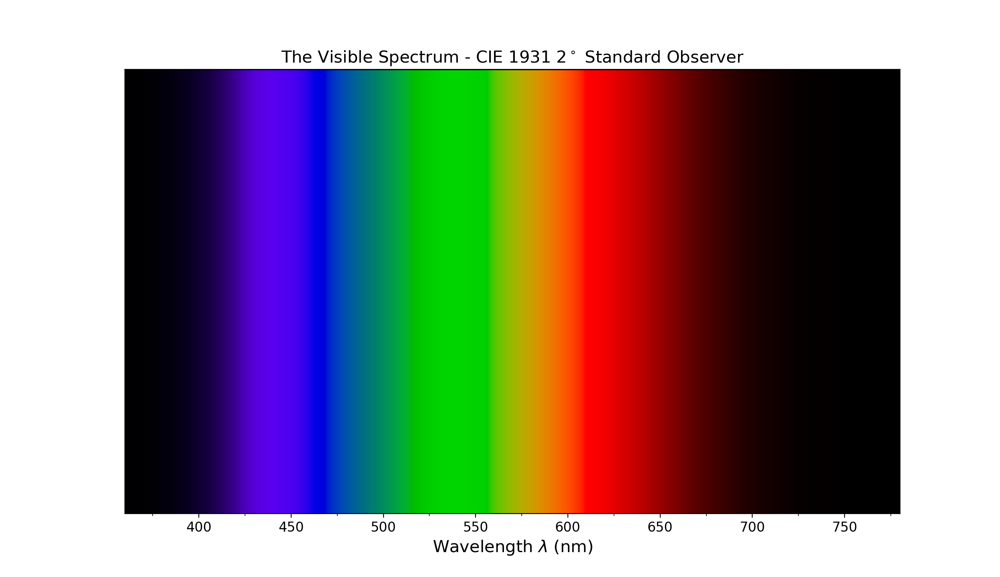

Spectral Distribution
***************************

.. code-block:: python

    >>> plot_single_illuminant_sd('FL1')

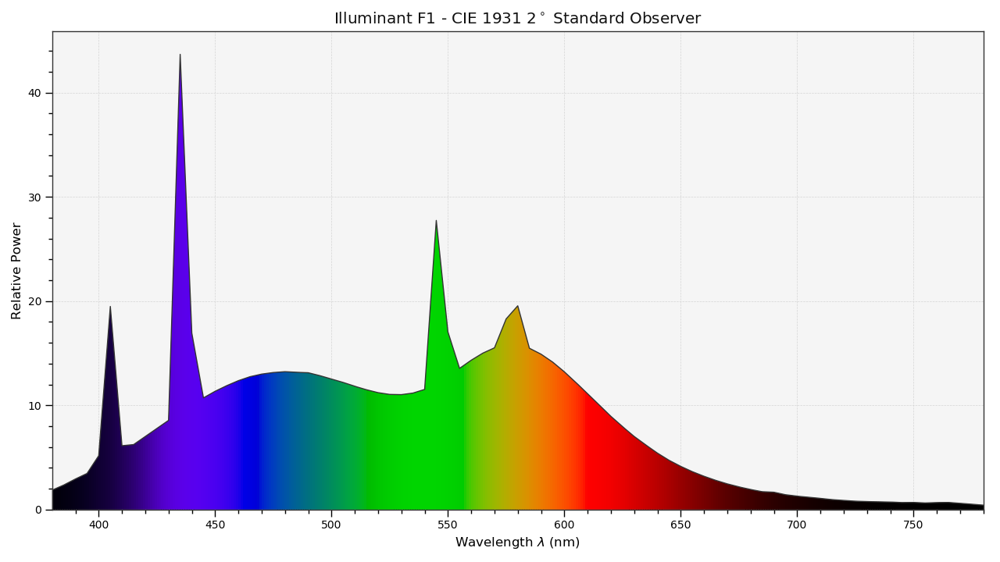

Blackbody
*********

.. code-block:: python

    >>> blackbody_sds = [
    ...     colour.sd_blackbody(i, colour.SpectralShape(0, 10000, 10))
    ...     for i in range(1000, 15000, 1000)
    ... ]
    >>> plot_multi_sds(
    ...     blackbody_sds,
    ...     y_label='W / (sr m$^2$) / m',
    ...     use_sds_colours=True,
    ...     normalise_sds_colours=True,
    ...     legend_location='upper right',
    ...     bounding_box=(0, 1250, 0, 2.5e15))

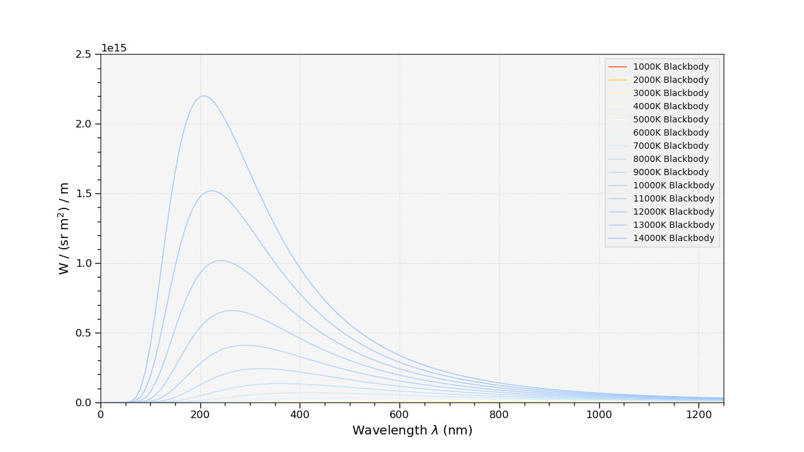

Colour Matching Functions
*************************

.. code-block:: python

    >>> plot_single_cmfs(
    ...     'Stockman & Sharpe 2 Degree Cone Fundamentals',
    ...     y_label='Sensitivity',
    ...     bounding_box=(390, 870, 0, 1.1))

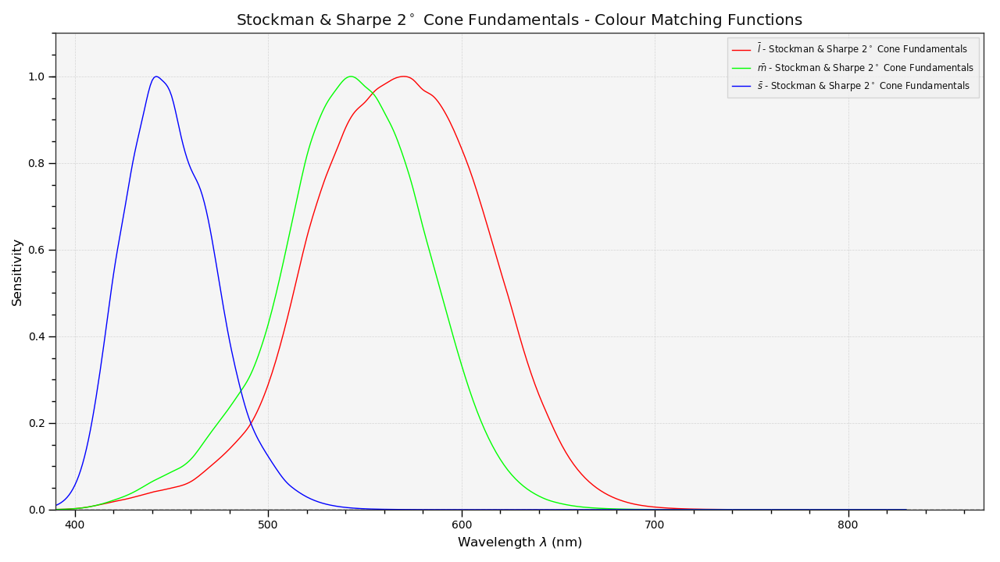

Luminous Efficiency
*******************

.. code-block:: python

    >>> sd_mesopic_luminous_efficiency_function = (
    ...     colour.sd_mesopic_luminous_efficiency_function(0.2))
    >>> plot_multi_sds(
    ...     (sd_mesopic_luminous_efficiency_function,
    ...      colour.PHOTOPIC_LEFS['CIE 1924 Photopic Standard Observer'],
    ...      colour.SCOTOPIC_LEFS['CIE 1951 Scotopic Standard Observer']),
    ...     y_label='Luminous Efficiency',
    ...     legend_location='upper right',
    ...     y_tighten=True,
    ...     margins=(0, 0, 0, .1))

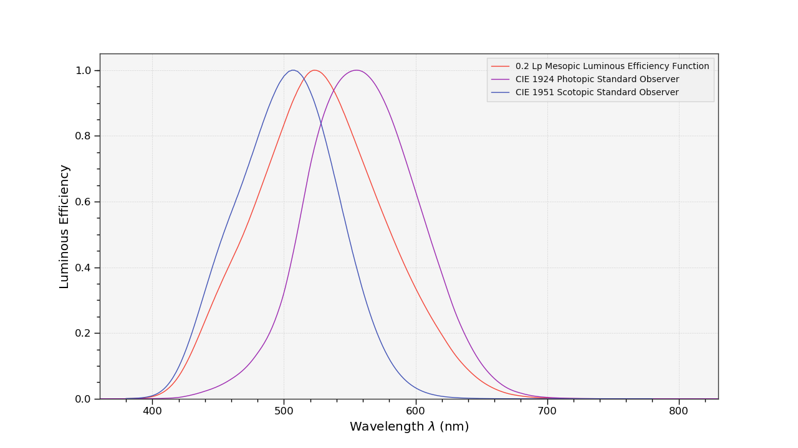

Colour Checker
**************

.. code-block:: python

    >>> from colour.characterisation.dataset.colour_checkers.sds import (
    ...     COLOURCHECKER_INDEXES_TO_NAMES_MAPPING)
    >>> plot_multi_sds(
    ...     [
    ...         colour.COLOURCHECKERS_SDS['BabelColor Average'][value]
    ...         for key, value in sorted(
    ...             COLOURCHECKER_INDEXES_TO_NAMES_MAPPING.items())
    ...     ],
    ...     use_sds_colours=True,
    ...     title=('BabelColor Average - '
    ...            'Spectral Distributions'))

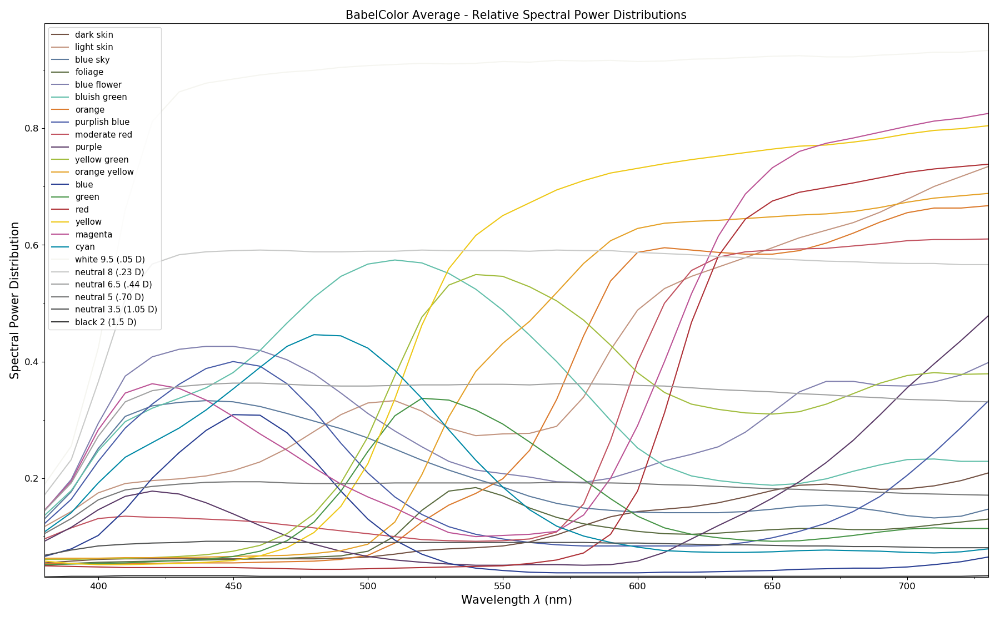

.. code-block:: python

    >>> plot_single_colour_checker('ColorChecker 2005', text_parameters={'visible': False})

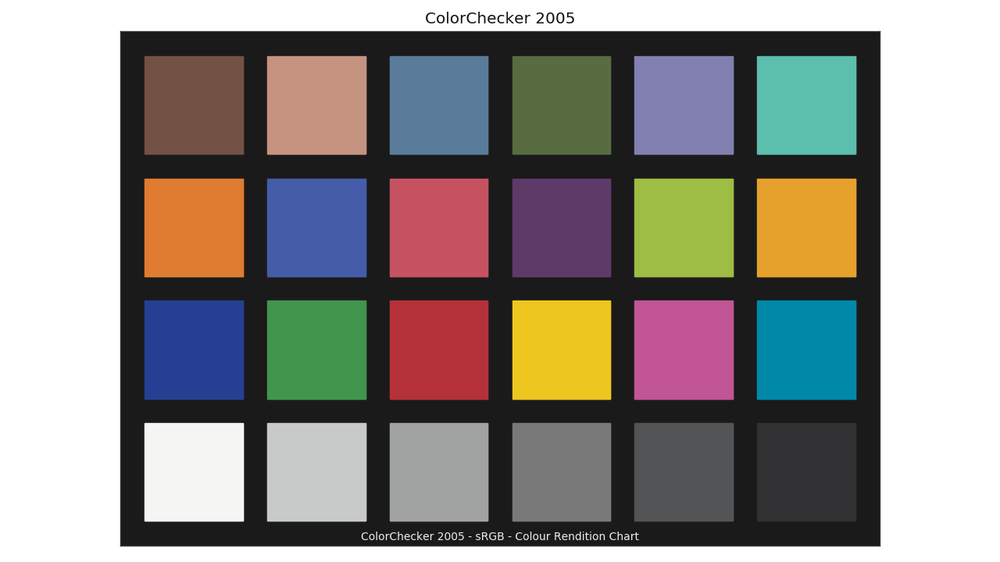

Chromaticities Prediction
*************************

.. code-block:: python

    >>> plot_corresponding_chromaticities_prediction(2, 'Von Kries', 'Bianco')

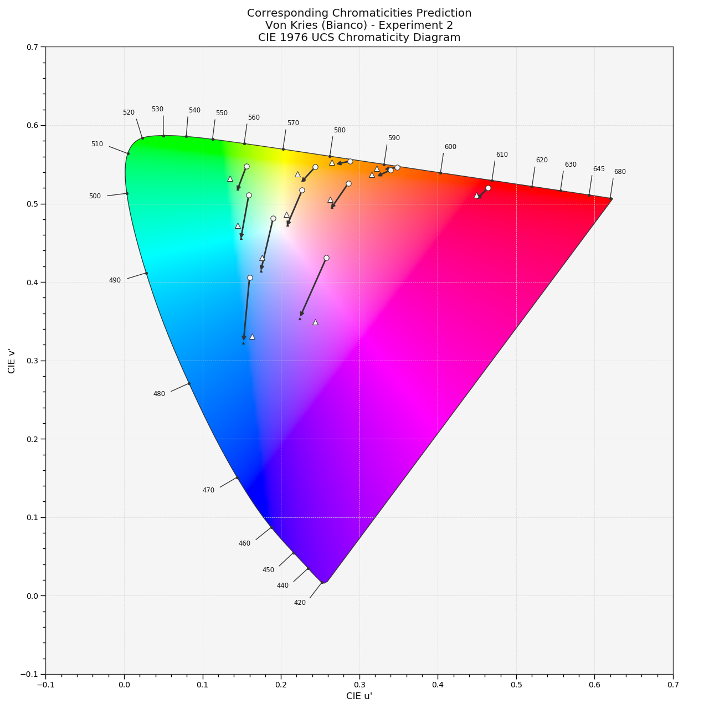

Colour Temperature
******************

.. code-block:: python

    >>> plot_planckian_locus_in_chromaticity_diagram_CIE1960UCS(['A', 'B', 'C'])

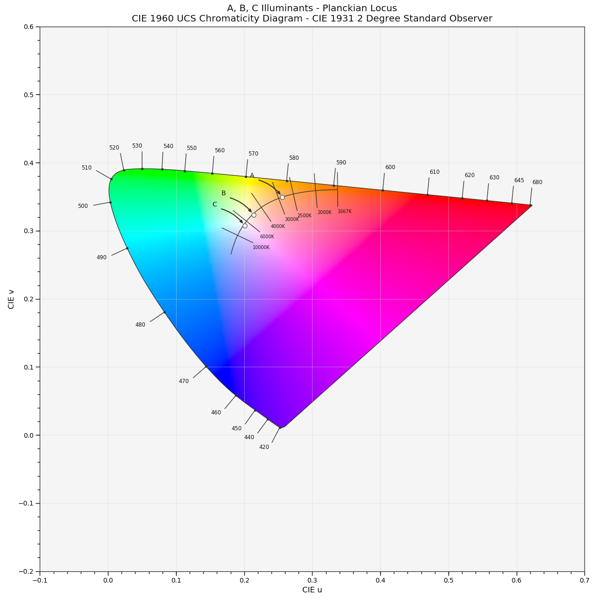

Chromaticities
**************

.. code-block:: python

    >>> import numpy as np
    >>> RGB = np.random.random((32, 32, 3))
    >>> plot_RGB_chromaticities_in_chromaticity_diagram_CIE1931(
    ...     RGB, 'ITU-R BT.709', colourspaces=['ACEScg', 'S-Gamut', 'Pointer Gamut'])

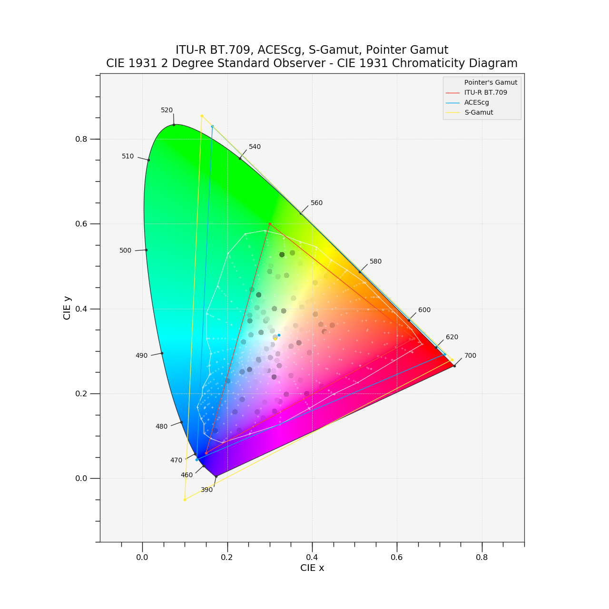

Colour Rendering Index
**********************

.. code-block:: python

    >>> plot_single_sd_colour_rendering_index_bars(
    ...     colour.ILLUMINANTS_SDS['FL2'])

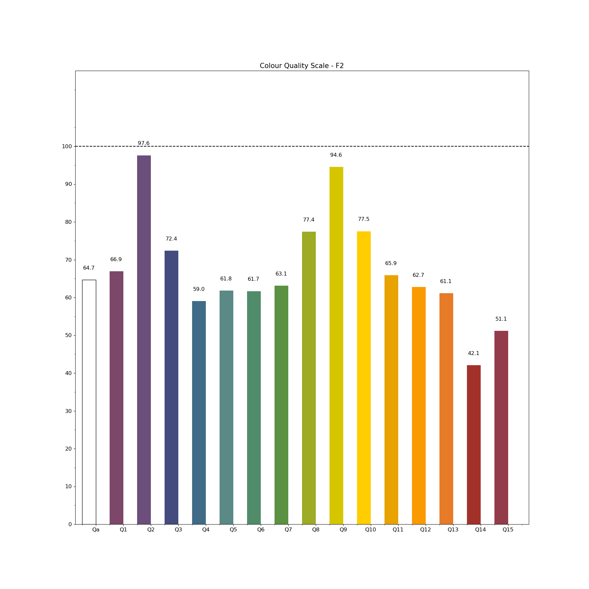

Contributing
------------

If you would like to contribute to `Colour <https://github.com/colour-science/colour>`_,
please refer to the following `Contributing <https://www.colour-science.org/contributing/>`_ guide.

Changes
-------

The changes are viewable on the `Releases <https://github.com/colour-science/colour/releases>`_ page.

Bibliography
------------

The bibliography is available on the `Bibliography <https://www.colour-science.org/bibliography/>`_ page.

It is also viewable directly from the repository in
`BibTeX <https://github.com/colour-science/colour/blob/develop/BIBLIOGRAPHY.bib>`_
format.

See Also
--------

Here is a list of notable colour science packages sorted by languages:

**Python**

- `ColorPy <http://markkness.net/colorpy/ColorPy.html>`_ by Kness, M.
- `Colorspacious <http://colorspacious.readthedocs.io/>`_ by Smith, N. J., et al.
- `python-colormath <http://python-colormath.readthedocs.io/>`_ by Taylor, G., et al.

**.NET**

- `Colourful <https://github.com/tompazourek/Colourful>`_ by Pažourek, T., et al.

**Julia**

- `Colors.jl <https://github.com/JuliaGraphics/Colors.jl>`_ by Holy, T., et al.

**Matlab & Octave**

- `COLORLAB <https://www.uv.es/vista/vistavalencia/software/colorlab.html>`_ by Malo, J., et al.
- `Psychtoolbox <http://psychtoolbox.org/>`_ by Brainard, D., et al.
- `The Munsell and Kubelka-Munk Toolbox <http://www.munsellcolourscienceforpainters.com/MunsellAndKubelkaMunkToolbox/MunsellAndKubelkaMunkToolbox.html>`_ by Centore, P.

About
-----

| **Colour** by Colour Developers - 2013-2019
| Copyright © 2013-2019 – Colour Developers – `colour-science@googlegroups.com <colour-science@googlegroups.com>`_
| This software is released under terms of New BSD License: http://opensource.org/licenses/BSD-3-Clause
| `http://github.com/colour-science/colour <http://github.com/colour-science/colour>`_