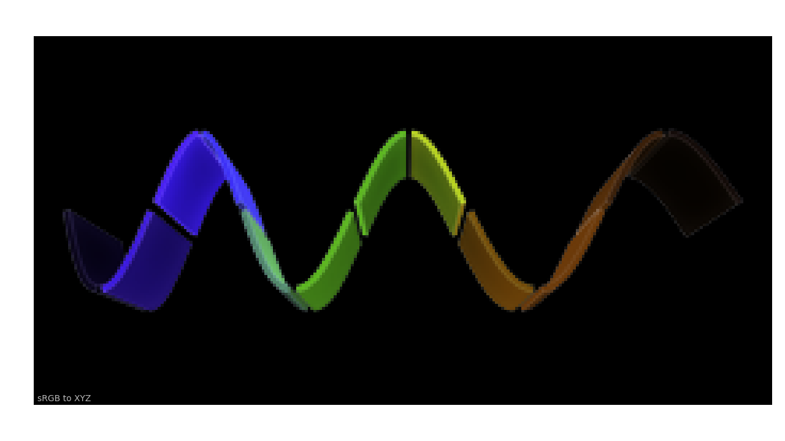

Basic Concepts
==============

This page puts an emphasis on basic concepts of **Colour**, those are important
to understand.

Object Name Categorisation
--------------------------

The API tries to bundle the objects by categories by naming them with common
prefixes which makes introspection and auto-completion easier.

For example, in `IPython <https://ipython.org>`__ or `Jupyter Notebook <https://jupyter.org>`__,
most of the definitions pertaining to the spectral distribution handling can
be found as follows:

.. code:: text

    In [1]: import colour

    In [2]: colour.sd_
     sd_blackbody()                            sd_gaussian()                             sd_rayleigh_scattering()                  sd_zeros
     sd_CIE_illuminant_D_series()              sd_mesopic_luminous_efficiency_function() sd_single_led()
     sd_CIE_standard_illuminant_A()            sd_multi_leds()                           sd_to_aces_relative_exposure_values()
     sd_constant()                             sd_ones()                                 sd_to_XYZ

Likewise, for the spectral distribution handling related attributes:

.. code:: text

    In [2]: colour.SD
                      SD_GAUSSIAN_METHODS   SD_TO_XYZ_METHODS     SDS_ILLUMINANTS       SDS_LIGHT_SOURCES
                      SD_MULTI_LEDS_METHODS SDS_COLOURCHECKERS    SDS_LEFS
                      SD_SINGLE_LED_METHODS SDS_FILTERS           SDS_LENSES

Similarly, all the RGB colourspaces can be individually accessed from the
``colour.models`` namespace:

.. code:: text

    In [2]: colour.models.RGB_COLOURSPACE
                             RGB_COLOURSPACE_ACES2065_1           RGB_COLOURSPACE_ACESPROXY            RGB_COLOURSPACE_APPLE_RGB            RGB_COLOURSPACE_BT470_525
                             RGB_COLOURSPACE_ACESCC               RGB_COLOURSPACE_ADOBE_RGB1998        RGB_COLOURSPACE_BEST_RGB             RGB_COLOURSPACE_BT470_625
                             RGB_COLOURSPACE_ACESCCT              RGB_COLOURSPACE_ADOBE_WIDE_GAMUT_RGB RGB_COLOURSPACE_BETA_RGB             RGB_COLOURSPACE_BT709                >
                             RGB_COLOURSPACE_ACESCG               RGB_COLOURSPACE_ARRI_WIDE_GAMUT_3    RGB_COLOURSPACE_BT2020               RGB_COLOURSPACE_CIE_RGB

Abbreviations
-------------

The following abbreviations are in use in `Colour <https://github.com/colour-science/Colour>`__:

- **CAM** : Colour Appearance Model
- **CCS** : Chromaticity Coordinates
- **CCTF** : Colour Component Transfer Function
- **CCT** : Correlated Colour Temperature
- **CMY** : Cyan, Magenta, Yellow
- **CMYK** : Cyan, Magenta, Yellow, Black
- **CVD** : Colour Vision Deficiency
- **CV** : Code Value
- **EOTF** : Electro-Optical Transfer Function
- **IDT** : Input Device Transform
- **MSDS** : Multi-Spectral Distributions
- **OETF** : Optical-Electrical Transfer Function
- **OOTF** : Optical-Optical Transfer Function
- **SD** : Spectral Distribution
- **TVS** : Tristimulus Values

N-Dimensional Array Support
---------------------------

Most of **Colour** definitions are fully vectorised and support n-dimensional
array by leveraging `Numpy <http://www.numpy.org>`__.

While it is recommended to use
`ndarray <https://docs.scipy.org/doc/numpy-1.13.0/reference/arrays.ndarray.html>`__
as input for the API objects, it is possible to use tuples or lists:

.. code:: python

    import colour

    xyY = (0.4316, 0.3777, 0.1008)
    colour.xyY_to_XYZ(xyY)

.. code-block:: text

    array([ 0.11518475,  0.1008    ,  0.05089373])

.. code:: python

    xyY = [0.4316, 0.3777, 0.1008]
    colour.xyY_to_XYZ(xyY)

.. code-block:: text

    array([ 0.11518475,  0.1008    ,  0.05089373])

.. code:: python

    xyY = [
        (0.4316, 0.3777, 0.1008),
        (0.4316, 0.3777, 0.1008),
        (0.4316, 0.3777, 0.1008),
    ]
    colour.xyY_to_XYZ(xyY)

.. code-block:: text

    array([[ 0.11518475,  0.1008    ,  0.05089373],
           [ 0.11518475,  0.1008    ,  0.05089373],
           [ 0.11518475,  0.1008    ,  0.05089373]])

As shown in the above example, there is widespread support for n-dimensional
arrays:

.. code:: python

    import numpy as np

    xyY = np.array([0.4316, 0.3777, 0.1008])
    xyY = np.tile(xyY, (6, 1))
    colour.xyY_to_XYZ(xyY)

.. code-block:: text

    array([[ 0.11518475,  0.1008    ,  0.05089373],
           [ 0.11518475,  0.1008    ,  0.05089373],
           [ 0.11518475,  0.1008    ,  0.05089373],
           [ 0.11518475,  0.1008    ,  0.05089373],
           [ 0.11518475,  0.1008    ,  0.05089373],
           [ 0.11518475,  0.1008    ,  0.05089373]])

.. code:: python

    colour.xyY_to_XYZ(xyY.reshape([2, 3, 3]))

.. code-block:: text

    array([[[ 0.11518475,  0.1008    ,  0.05089373],
            [ 0.11518475,  0.1008    ,  0.05089373],
            [ 0.11518475,  0.1008    ,  0.05089373]],

           [[ 0.11518475,  0.1008    ,  0.05089373],
            [ 0.11518475,  0.1008    ,  0.05089373],
            [ 0.11518475,  0.1008    ,  0.05089373]]])

Which enables image processing:

.. code:: python

    RGB = colour.read_image("_static/Logo_Small_001.png")
    RGB = RGB[..., 0:3]  # Discarding alpha channel.
    XYZ = colour.sRGB_to_XYZ(RGB)
    colour.plotting.plot_image(XYZ, text_kwargs={"text": "sRGB to XYZ"})

.. _spectral-representation-and-continuous-signal:

Spectral Representation and Continuous Signal
---------------------------------------------

Floating Point Wavelengths
~~~~~~~~~~~~~~~~~~~~~~~~~~

**Colour** `current representation <https://github.com/colour-science/colour/releases/tag/v0.3.11>`__
of spectral data is atypical and has been influenced by the failures and
shortcomings of the previous implementation that required
`less than ideal code <https://github.com/colour-science/colour/commit/1e6a00ac2f39efa5ab297036366f8c9b90113caf>`__
to support floating point wavelengths. Wavelengths should not have to be
defined as integer values and it is effectively common to get data from
instruments whose domain is returned as floating point values.

For example, the data from an `Ocean Insight (Optics) STS-VIS <https://www.oceaninsight.com/products/spectrometers/microspectrometer/sts-series/sts-vis>`__
spectrometer is typically saved with 3 digits decimal precision:

.. code-block:: text

    Data from Subt2_14-36-15-210.txt Node

    Date: Sat Nov 17 14:36:15 NZDT 2018
    User: kelsolaar
    Spectrometer: S12286
    Trigger mode: 0
    Resolution mode: 1024 pixels
    Integration Time (sec): 5.000000E0
    Scans to average: 3
    Nonlinearity correction enabled: true
    Boxcar width: 3
    Baseline correction enabled: true
    XAxis mode: Wavelengths
    Number of Pixels in Spectrum: 1024
    # >>>>>Begin Spectral Data<<<<<
    338.028	279.71
    338.482	285.43
    338.936	291.33
    ...
    821.513	3112.65
    822.008	3133.74
    822.503	3107.11

A solution to the problem is to quantize the data at integer values but it
is often non-desirable. The spectra representation implementation prior to
**Colour 0.3.11** was relying on a `custom mutable mapping <https://github.com/colour-science/colour/blob/1e6a00ac2f39efa5ab297036366f8c9b90113caf/colour/utilities/data_structures.py#L38>`__
which was allowing to retrieve decimal keys within a given precision:

.. code:: python

    data_1 = {0.1999999998: "Nemo", 0.2000000000: "John"}
    apm_1 = ArbitraryPrecisionMapping(data_1, key_decimals=10)
    tuple(apm_1.keys())

.. code-block:: text

    (0.1999999998, 0.2)

.. code:: python

    apm_2 = ArbitraryPrecisionMapping(data_1, key_decimals=7)
    tuple(apm_2.keys())

.. code-block:: text

    (0.2,)

While functional, the approach was brittle and not elegant which triggered a
`significant amount of rework <https://nbviewer.jupyter.org/github/colour-science/colour-ramblings/blob/master/spectral_signal.ipynb>`__.

Continuous Signal
~~~~~~~~~~~~~~~~~

All the spectral distributions in **Colour** are instances of the
:class:`colour.SpectralDistribution` class (or its sub-classes), a sub-class of
the :class:`colour.continuous.Signal` class which is itself an implementation
of the :class:`colour.continuous.AbstractContinuousFunction` `ABCMeta <https://docs.python.org/3.7/library/abc.html>`__
class:

.. inheritance-diagram:: colour.SpectralDistribution
   :parts: 1

Likewise, the multi-spectral distributions are instances
:class:`colour.MultiSpectralDistributions` class (or its sub-classes), a
sub-class of the :class:`colour.continuous.MultiSignals` class which is a
container for multiple :class:`colour.continuous.Signal` sub-class instances
and also implements the :class:`colour.continuous.AbstractContinuousFunction`
ABCMeta class.

.. inheritance-diagram:: colour.MultiSpectralDistributions
   :parts: 1

The :class:`colour.continuous.Signal` class implements the
:meth:`Signal.function` method so that evaluating the function for any
independent domain :math:`x \in\mathbb{R}` variable returns a corresponding
range :math:`y \in\mathbb{R}` variable.

It adopts an interpolating function encapsulated inside an extrapolating
function. The resulting function independent domain, stored as discrete values
in the :attr:`colour.continuous.Signal.domain` attribute corresponds with the
function dependent and already known range stored in the
:attr:`colour.continuous.Signal.range` attribute.

Consequently, it is possible to get the value of a spectral distribution at any
given wavelength:

.. code:: python

    data = {
        500: 0.0651,
        520: 0.0705,
        540: 0.0772,
        560: 0.0870,
        580: 0.1128,
        600: 0.1360,
    }
    sd = colour.SpectralDistribution(data)
    sd[555.5]

.. code-block:: text

    0.083453673782958995

Getting, Setting, Indexing and Slicing
~~~~~~~~~~~~~~~~~~~~~~~~~~~~~~~~~~~~~~

.. attention::

    Indexing a spectral distribution (or multi-spectral distribution) with a
    numeric (or a numeric sequence) returns the corresponding value(s).
    Indexing a spectral distribution (or multi-spectral distribution) with a
    slice returns the values for the corresponding wavelength *indexes*.

While it is tempting to think that the :class:`colour.SpectralDistribution`
and :class:`colour.MultiSpectralDistributions` classes behave like Numpy's
`ndarray <https://numpy.org/doc/stable/reference/generated/numpy.ndarray.html>`__,
they do not entirely and some peculiarities exist that make them different.

An important difference lies in the behaviour with respect to getting and
setting the values of the data.

Getting the value(s) for a single (or multiple wavelengths) is done by indexing
the :class:`colour.SpectralDistribution` (or
:class:`colour.MultiSpectralDistributions`) class with the a single numeric
or array of numeric wavelengths, e.g. ``sd[555.5]`` or
``sd[555.25, 555.25, 555.75]``.

However, if getting the values using a :class:`slice` class instance, e.g.
``sd[0:3]``, the underlying discrete values for the indexes represented by the
:class:`slice` class instance are returned instead.

As shown in the previous section, getting the value of a wavelength is done as
follows:

.. code:: python

    data = {
        500: 0.0651,
        520: 0.0705,
        540: 0.0772,
        560: 0.0870,
        580: 0.1128,
        600: 0.1360,
    }
    sd = colour.SpectralDistribution(data)
    sd[555]

.. code-block:: text

    0.083135180664062502,

Multiple wavelength values can be retrieved as follows:

.. code:: python

    sd[(555.0, 556.25, 557.5, 558.75, 560.0)]

.. code-block:: text

    array([ 0.08313518,  0.08395997,  0.08488108,  0.085897  ,  0.087     ])

However, slices will return the values for the corresponding wavelength
*indexes*:

.. code:: python

    sd[0:3]

.. code-block:: text

    array([ 0.0651,  0.0705,  0.0772])

.. code:: python

    sd[:]

.. code-block:: text

    array([ 0.0651,  0.0705,  0.0772,  0.087 ,  0.1128,  0.136 ])

.. note::

    Indexing a multi-spectral distribution is achieved similarly, it can
    however be sliced along multiple axes because the data is2-dimensional,
    e.g. `msds[0:3, 0:2]`.

A *copy* of the underlying :class:`colour.SpectralDistribution` and
:class:`colour.MultiSpectralDistributions` classes discretized data can be
accessed via the ``wavelengths`` and ``values`` properties. However, it cannot
be changed directly via the properties or slicing:

.. attention::

    The data returned by the ``wavelengths`` and ``values`` properties is a
    *copy* of the underlying :class:`colour.SpectralDistribution` and
    :class:`colour.MultiSpectralDistributions` classes discretized data: It
    can only be changed indirectly.

.. code:: python

    data = {
        500: 0.0651,
        520: 0.0705,
        540: 0.0772,
        560: 0.0870,
        580: 0.1128,
        600: 0.1360,
    }
    sd = colour.SpectralDistribution(data)
    # Note: The wavelength 500nm is at index 0.
    sd.values[0] = 0
    sd[500]

.. code-block:: text

    0.065100000000000019

Instead, the values can be set indirectly:

.. code:: python

    values = sd.values
    values[0] = 0
    sd.values = values
    sd.values

.. code-block:: text

    array([ 0.    ,  0.0705,  0.0772,  0.087 ,  0.1128,  0.136 ])

Domain-Range Scales
-------------------

.. note::

    This section contains important information.

**Colour** adopts 4 main input domains and output ranges:

-   *Scalars* usually in domain-range `[0, 1]` (or `[0, 10]` for
    *Munsell Value*).
-   *Percentages* usually in domain-range `[0, 100]`.
-   *Degrees* usually in domain-range `[0, 360]`.
-   *Integers* usually in domain-range `[0, 2**n -1]` where `n` is the bit
    depth.

It is error prone but it is also a direct consequence of the inconsistency of
the colour science field itself. We have discussed at length about this and we
were leaning toward normalisation of the whole API to domain-range `[0, 1]`, we
never committed for reasons highlighted by the following points:

-   Colour Scientist performing computations related to Munsell Renotation
    System would be very surprised if the output *Munsell Value* was in range
    `[0, 1]` or `[0, 100]`.
-   A Visual Effect Industry artist would be astonished to find out that
    conversion from *CIE XYZ* to *sRGB* was yielding values in range
    `[0, 100]`.

However benefits of having a consistent and predictable domain-range scale are
numerous thus with `Colour 0.3.12 <https://github.com/colour-science/colour/releases/tag/v0.3.12>`__
we have introduced a mechanism to allow users to work within one of the two
available domain-range scales.

Scale - Reference
~~~~~~~~~~~~~~~~~

**'Reference'** is the default domain-range scale of **Colour**, objects adopt
the implemented reference, i.e. paper, publication, etc.., domain-range scale.

The **'Reference'** domain-range scale is inconsistent, e.g. colour appearance
models, spectral conversions are typically in domain-range `[0, 100]` while RGB
models will operate in domain-range `[0, 1]`. Some objects, e.g.
:func:`colour.colorimetry.lightness_Fairchild2011` definition have mismatched
domain-range: input domain `[0, 1]` and output range `[0, 100]`.

Scale - 1
~~~~~~~~~

**'1'** is a domain-range scale converting all the relevant objects from
**Colour** public API to domain-range `[0, 1]`:

-   *Scalars* in domain-range `[0, 10]`, e.g *Munsell Value* are
    scaled by *10*.
-   *Percentages* in domain-range `[0, 100]` are scaled by *100*.
-   *Degrees* in domain-range `[0, 360]` are scaled by *360*.
-   *Integers* in domain-range `[0, 2**n -1]` where `n` is the bit
    depth are scaled by *2**n -1*.
-   *Dimensionless* values are unaffected and are indicated with `DN`.
-   *Unaffected* values are unaffected and are indicated with `UN`.

.. warning::

    The conversion to **'1'** domain-range scale is a *soft* normalisation and
    similarly to the **'Reference'** domain-range scale it is normal to
    encounter values exceeding *1*, e.g. High Dynamic Range Imagery (HDRI) or
    negative values, e.g. out-of-gamut RGB colourspace values. Some definitions
    such as :func:`colour.models.eotf_ST2084` which decodes absolute luminance
    values are not affected by any domain-range scales and are indicated with
    `UN`.

Understanding the Domain-Range Scale of an Object
~~~~~~~~~~~~~~~~~~~~~~~~~~~~~~~~~~~~~~~~~~~~~~~~~

Using :func:`colour.adaptation.chromatic_adaptation_CIE1994` definition
docstring as an example, the *Notes* section features two tables.

The first table is for the domain, and lists the input arguments affected by
the two domain-range scales and which normalisation they should adopt
depending the domain-range scale in use:

+------------+-----------------------+---------------+
| **Domain** | **Scale - Reference** | **Scale - 1** |
+============+=======================+===============+
| ``XYZ_1``  | [0, 100]              | [0, 1]        |
+------------+-----------------------+---------------+
| ``Y_o``    | [0, 100]              | [0, 1]        |
+------------+-----------------------+---------------+

The second table is for the range and lists the return value of the definition:

+------------+-----------------------+---------------+
| **Range**  | **Scale - Reference** | **Scale - 1** |
+============+=======================+===============+
| ``XYZ_2``  | [0, 100]              | [0, 1]        |
+------------+-----------------------+---------------+

Working with the Domain-Range Scales
~~~~~~~~~~~~~~~~~~~~~~~~~~~~~~~~~~~~

The current domain-range scale is returned with the
:func:`colour.get_domain_range_scale` definition:

.. code:: python

    import colour

    colour.get_domain_range_scale()

.. code-block:: text

    u'reference'

Changing from the **'Reference'** default domain-range scale to **'1'** is done
with the :func:`colour.set_domain_range_scale` definition:

.. code:: python

    XYZ_1 = [28.00, 21.26, 5.27]
    xy_o1 = [0.4476, 0.4074]
    xy_o2 = [0.3127, 0.3290]
    Y_o = 20
    E_o1 = 1000
    E_o2 = 1000
    colour.adaptation.chromatic_adaptation_CIE1994(XYZ_1, xy_o1, xy_o2, Y_o, E_o1, E_o2)

.. code-block:: text

    array([ 24.03379521,  21.15621214,  17.64301199])

.. code:: python

    colour.set_domain_range_scale("1")

    XYZ_1 = [0.2800, 0.2126, 0.0527]
    Y_o = 0.2
    colour.adaptation.chromatic_adaptation_CIE1994(XYZ_1, xy_o1, xy_o2, Y_o, E_o1, E_o2)

.. code-block:: text

    array([ 0.24033795,  0.21156212,  0.17643012])

The output tristimulus values with the **'1'** domain-range scale are equal to
those from **'Reference'** default domain-range scale divided by *100*.

Passing incorrectly scaled values to the
:func:`colour.adaptation.chromatic_adaptation_CIE1994` definition
would result in unexpected values and a warning in that case:

.. code:: python

    colour.set_domain_range_scale("Reference")

    colour.adaptation.chromatic_adaptation_CIE1994(XYZ_1, xy_o1, xy_o2, Y_o, E_o1, E_o2)

.. code-block:: text

    File "<ipython-input-...>", line 4, in <module>
      E_o2)
    File "/colour-science/colour/colour/adaptation/cie1994.py", line 134, in chromatic_adaptation_CIE1994
      warning(('"Y_o" luminance factor must be in [18, 100] domain, '
    /colour-science/colour/colour/utilities/verbose.py:207: ColourWarning: "Y_o" luminance factor must be in [18, 100] domain, unpredictable results may occur!
      warn(*args, **kwargs)
    array([ 0.17171825,  0.13731098,  0.09972054])

Setting the **'1'** domain-range scale has the following effect on the
:func:`colour.adaptation.chromatic_adaptation_CIE1994` definition:

As it expects values in domain `[0, 100]`, scaling occurs and the
relevant input values, i.e. the values listed in the domain table, ``XYZ_1``
and ``Y_o`` are converted from domain `[0, 1]` to domain `[0, 100]` by
:func:`colour.utilities.to_domain_100` definition and conversely
return value ``XYZ_2`` is converted from range `[0, 100]` to range `[0, 1]` by
:func:`colour.utilities.from_range_100` definition.

A convenient alternative to the :func:`colour.set_domain_range_scale`
definition is the :class:`colour.domain_range_scale` context manager and
decorator. It temporarily overrides **Colour** domain-range scale with given
scale value:

.. code:: python

    with colour.domain_range_scale("1"):
        colour.adaptation.chromatic_adaptation_CIE1994(XYZ_1, xy_o1, xy_o2, Y_o, E_o1, E_o2)

.. code-block:: text

    [ 0.24033795  0.21156212  0.17643012]

Multiprocessing on Windows with Domain-Range Scales
~~~~~~~~~~~~~~~~~~~~~~~~~~~~~~~~~~~~~~~~~~~~~~~~~~~

Windows does not have a `fork <https://linux.die.net/man/2/fork>`__ system call,
a consequence is that child processes do not necessarily
`inherit from changes made to global variables <https://docs.python.org/2/library/multiprocessing.html#windows>`__.

It has crucial `consequences <https://stackoverflow.com/q/55742917/931625>`__
as **Colour** stores the current domain-range scale into a global variable.

The solution is to define an initialisation definition that defines the
scale upon child processes spawning.

The :class:`colour.utilities.multiprocessing_pool` context manager conveniently
performs the required initialisation so that the domain-range scale is
propagated appropriately to child processes.

Safe Power and Division
-----------------------

**Colour** default handling of fractional power and zero-division occurring
during practical applications is managed via varous definitions and context
managers.

Safe Power
~~~~~~~~~~

NaNs generation occurs when a negative number :math:`a` is raised to the
fractional power :math:`p`. This can be avoided using the
:func:`colour.algebra.spow` definition that raises to the power as follows:
:math:`sign(a) * |a|^p`.

To the extent possible, the :func:`colour.algebra.spow` definition has been
used throughout the codebase. The default behaviour is controlled with the
following definitions:

-   :func:`colour.algebra.is_spow_enabled`
-   :func:`colour.algebra.set_spow_enabled`
-   :func:`colour.algebra.spow_enable` (Context Manager & Decorator)

Safe Division
~~~~~~~~~~~~~

NaNs and +/- infs generation occurs when a number :math:`a` is divided 0. This
can be avoided using the :func:`colour.algebra.sdiv` definition. It has been
used wherever deemed relevant in the codebase. The default behaviour is
controlled with the following definitions:

-   :func:`colour.algebra.get_sdiv_mode`
-   :func:`colour.algebra.set_sdiv_mode`
-   :func:`colour.algebra.sdiv_mode` (Context Manager & Decorator)

The following modes are available:

-   ``Numpy``: The current *Numpy* zero-division handling occurs.
-   ``Ignore``: Zero-division occurs silently.
-   ``Warning``: Zero-division occurs with a warning.
-   ``Ignore Zero Conversion``: Zero-division occurs silently and NaNs or
    +/- infs values are converted to zeros. See :func:`numpy.nan_to_num`
    definition for more details.
-   ``Warning Zero Conversion``: Zero-division occurs with a warning and NaNs
    or +/- infs values are converted to zeros. See :func:`numpy.nan_to_num`
    definition for more details.
-   ``Ignore Limit Conversion``: Zero-division occurs silently and NaNs or
    +/- infs values are converted to zeros or the largest +/- finite floating
    point values representable by the division result :class:`numpy.dtype`.
    See :func:`numpy.nan_to_num` definition for more details.
-   ``Warning Limit Conversion``: Zero-division occurs  with a warning and
    NaNs or +/- infs values are converted to zeros or the largest +/- finite
    floating point values representable by the division result
    :class:`numpy.dtype`.

.. code:: python

    colour.algebra.get_sdiv_mode()

.. code-block:: text

    'Ignore Zero Conversion'

.. code:: python

    colour.algebra.set_sdiv_mode("Numpy")
    colour.UCS_to_uv([0, 0, 0])

.. code-block:: text

    /Users/kelsolaar/Documents/Development/colour-science/colour/colour/algebra/common.py:317: RuntimeWarning: invalid value encountered in true_divide
      c = a / b
    array([ nan,  nan])

.. code:: python

    colour.algebra.set_sdiv_mode("Ignore Zero Conversion")
    colour.UCS_to_uv([0, 0, 0])

.. code-block:: text

    array([ 0.,  0.])
