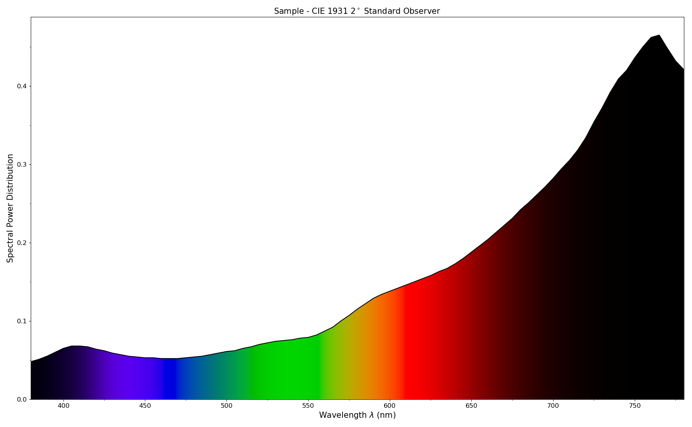
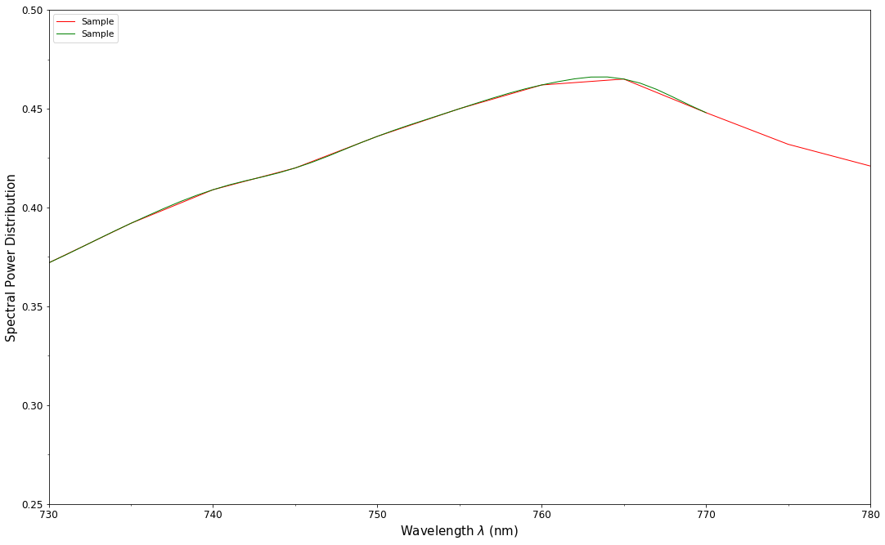

Tutorial
========

`Colour <https://github.com/colour-science/Colour/>`__ spreads over
various domains of Colour Science from colour models to optical
phenomena, this tutorial will not give you a complete overview of the
API but will still be a good introduction.

.. note::

    A directory full of examples is available at this path in your
    `Colour <https://github.com/colour-science/Colour/>`__ installation:
    *colour/examples*. You can also explore it directly on Github:
    https://github.com/colour-science/colour/tree/master/colour/examples

.. code:: python

    from colour.plotting import *

    colour_plotting_defaults()

    visible_spectrum_plot()

.. image:: _static/Tutorial_Visible_Spectrum.png

Overview
--------

`Colour <https://github.com/colour-science/Colour/>`__ is organised
around various sub-packages:

-  :doc:`adaptation <colour.adaptation>`: Chromatic adaptation models and transformations.
-  :doc:`algebra <colour.algebra>`: Algebra utilities.
-  :doc:`appearance <colour.appearance>`: Colour appearance models.
-  :doc:`biochemistry <colour.biochemistry>`: Biochemistry computations.
-  :doc:`continuous <colour.continuous>`: Base objects for continuous data representation.
-  :doc:`characterisation <colour.characterisation>`: Colour fitting and camera characterisation.
-  :doc:`colorimetry <colour.colorimetry>`: Core objects for colour computations.
-  :doc:`constants <colour.constants>`: *CIE* and *CODATA* constants.
-  :doc:`corresponding <colour.corresponding>`: Corresponding colour chromaticities computations.
-  :doc:`difference <colour.difference>`: Colour difference computations.
-  *examples*: Examples for the sub-packages.
-  :doc:`io <colour.io>`: Input / output objects for reading and writing data.
-  :doc:`models <colour.models>`: Colour models.
-  :doc:`notation <colour.notation>`: Colour notation systems.
-  :doc:`phenomena <colour.phenomena>`: Computation of various optical phenomena.
-  :doc:`plotting <colour.plotting>`: Diagrams, figures, etc…
-  :doc:`quality <colour.quality>`: Colour quality computation.
-  :doc:`recovery <colour.recovery>`: Reflectance recovery.
-  :doc:`temperature <colour.temperature>`: Colour temperature and correlated colour temperature
   computation.
-  :doc:`utilities <colour.utilities>`: Various utilities and data structures.
-  :doc:`volume <colour.volume>`: Colourspace volumes computation and optimal colour
   stimuli.

Most of the public API is available from the root colour namespace:

.. code:: python

    import colour

    print(colour.__all__[:5] + ['...'])

.. code-block:: text

    ['handle_numpy_errors', 'ignore_numpy_errors', 'raise_numpy_errors', 'print_numpy_errors', 'warn_numpy_errors', '...']

The various sub-packages also expose their public API:

.. code:: python

    from pprint import pprint

    import colour.plotting

    for sub_package in ('adaptation', 'algebra', 'appearance', 'biochemistry',
                        'characterisation', 'colorimetry', 'constants',
                        'continuous', 'corresponding', 'difference', 'io',
                        'models', 'notation', 'phenomena', 'plotting', 'quality',
                        'recovery', 'temperature', 'utilities', 'volume'):
        print(sub_package.title())
        pprint(getattr(colour, sub_package).__all__[:5] + ['...'])
        print('\n')

.. code-block:: text

    Adaptation
    ['CHROMATIC_ADAPTATION_TRANSFORMS',
     'XYZ_SCALING_CAT',
     'VON_KRIES_CAT',
     'BRADFORD_CAT',
     'SHARP_CAT',
     '...']

    Algebra
    ['cartesian_to_spherical',
     'spherical_to_cartesian',
     'cartesian_to_polar',
     'polar_to_cartesian',
     'cartesian_to_cylindrical',
     '...']

    Appearance
    ['Hunt_InductionFactors',
     'HUNT_VIEWING_CONDITIONS',
     'Hunt_Specification',
     'XYZ_to_Hunt',
     'ATD95_Specification',
     '...']

    Biochemistry
    ['reaction_rate_MichealisMenten',
     'substrate_concentration_MichealisMenten',
     '...']

    Characterisation
    ['RGB_SpectralSensitivities',
     'RGB_DisplayPrimaries',
     'CAMERAS_RGB_SPECTRAL_SENSITIVITIES',
     'COLOURCHECKERS',
     'COLOURCHECKER_INDEXES_TO_NAMES_MAPPING',
     '...']

    Colorimetry
    ['SpectralShape',
     'SpectralPowerDistribution',
     'MultiSpectralPowerDistribution',
     'DEFAULT_SPECTRAL_SHAPE',
     'constant_spd',
     '...']

    Continuous
    ['AbstractContinuousFunction', 'Signal', 'MultiSignal', '...']

    Constants
    ['CIE_E', 'CIE_K', 'K_M', 'KP_M', 'AVOGADRO_CONSTANT', '...']

    Corresponding
    ['BRENEMAN_EXPERIMENTS',
     'BRENEMAN_EXPERIMENTS_PRIMARIES_CHROMATICITIES',
     'corresponding_chromaticities_prediction_CIE1994',
     'corresponding_chromaticities_prediction_CMCCAT2000',
     'corresponding_chromaticities_prediction_Fairchild1990',
     '...']

    Difference
    ['DELTA_E_METHODS',
     'delta_E',
     'delta_E_CIE1976',
     'delta_E_CIE1994',
     'delta_E_CIE2000',
     '...']

    Io
    ['IES_TM2714_Spd',
     'read_image',
     'write_image',
     'read_spectral_data_from_csv_file',
     'read_spds_from_csv_file',
     '...']

    Models
    ['XYZ_to_xyY', 'xyY_to_XYZ', 'xy_to_xyY', 'xyY_to_xy', 'xy_to_XYZ', '...']

    Notation
    ['MUNSELL_COLOURS_ALL',
     'MUNSELL_COLOURS_1929',
     'MUNSELL_COLOURS_REAL',
     'MUNSELL_COLOURS',
     'munsell_value',
     '...']

    Phenomena
    ['scattering_cross_section',
     'rayleigh_optical_depth',
     'rayleigh_scattering',
     'rayleigh_scattering_spd',
     '...']

    Plotting
    ['ASTM_G_173_ETR',
     'PLOTTING_RESOURCES_DIRECTORY',
     'DEFAULT_FIGURE_ASPECT_RATIO',
     'DEFAULT_FIGURE_WIDTH',
     'DEFAULT_FIGURE_HEIGHT',
     '...']

    Quality
    ['TCS_SPDS',
     'VS_SPDS',
     'CRI_Specification',
     'colour_rendering_index',
     'CQS_Specification',
     '...']

    Recovery
    ['SMITS_1999_SPDS',
     'XYZ_to_spectral_Meng2015',
     'RGB_to_spectral_Smits1999',
     'REFLECTANCE_RECOVERY_METHODS',
     'XYZ_to_spectral',
     '...']

    Temperature
    ['CCT_TO_UV_METHODS',
     'UV_TO_CCT_METHODS',
     'CCT_to_uv',
     'CCT_to_uv_Ohno2013',
     'CCT_to_uv_Robertson1968',
     '...']

    Utilities
    ['handle_numpy_errors',
     'ignore_numpy_errors',
     'raise_numpy_errors',
     'print_numpy_errors',
     'warn_numpy_errors',
     '...']

    Volume
    ['ILLUMINANTS_OPTIMAL_COLOUR_STIMULI',
     'is_within_macadam_limits',
     'is_within_mesh_volume',
     'is_within_pointer_gamut',
     'is_within_visible_spectrum',
     '...']

The code is documented and almost every docstrings have usage examples:

.. code:: python

    print(colour.temperature.CCT_to_uv_Ohno2013.__doc__)

.. code-block:: text

        Returns the *CIE UCS* colourspace *uv* chromaticity coordinates from given
        correlated colour temperature :math:`T_{cp}`, :math:`\Delta_{uv}` and
        colour matching functions using *Ohno (2013)* method.

        Parameters
        ----------
        CCT : numeric
            Correlated colour temperature :math:`T_{cp}`.
        D_uv : numeric, optional
            :math:`\Delta_{uv}`.
        cmfs : XYZ_ColourMatchingFunctions, optional
            Standard observer colour matching functions.

        Returns
        -------
        ndarray
            *CIE UCS* colourspace *uv* chromaticity coordinates.

        References
        ----------
        .. [4]  Ohno, Y. (2014). Practical Use and Calculation of CCT and Duv.
                LEUKOS, 10(1), 47–55. doi:10.1080/15502724.2014.839020

        Examples
        --------
        >>> from colour import STANDARD_OBSERVERS_CMFS
        >>> cmfs = STANDARD_OBSERVERS_CMFS['CIE 1931 2 Degree Standard Observer']
        >>> CCT = 6507.4342201047066
        >>> D_uv = 0.003223690901513
        >>> CCT_to_uv_Ohno2013(CCT, D_uv, cmfs)  # doctest: +ELLIPSIS
        array([ 0.1977999...,  0.3122004...])

At the core of `Colour <https://github.com/colour-science/Colour/>`__ is
the ``colour.colorimetry`` sub-package, it defines the objects needed
for spectral related computations and many others:

.. code:: python

    import colour.colorimetry as colorimetry

    pprint(colorimetry.__all__)

.. code-block:: text

    ['SpectralShape',
     'SpectralPowerDistribution',
     'MultiSpectralPowerDistribution',
     'DEFAULT_SPECTRAL_SHAPE',
     'constant_spd',
     'zeros_spd',
     'ones_spd',
     'blackbody_spd',
     'blackbody_spectral_radiance',
     'planck_law',
     'LMS_ConeFundamentals',
     'RGB_ColourMatchingFunctions',
     'XYZ_ColourMatchingFunctions',
     'CMFS',
     'LMS_CMFS',
     'RGB_CMFS',
     'STANDARD_OBSERVERS_CMFS',
     'ILLUMINANTS',
     'D_ILLUMINANTS_S_SPDS',
     'HUNTERLAB_ILLUMINANTS',
     'ILLUMINANTS_RELATIVE_SPDS',
     'LIGHT_SOURCES',
     'LIGHT_SOURCES_RELATIVE_SPDS',
     'LEFS',
     'PHOTOPIC_LEFS',
     'SCOTOPIC_LEFS',
     'BANDPASS_CORRECTION_METHODS',
     'bandpass_correction',
     'bandpass_correction_Stearns1988',
     'D_illuminant_relative_spd',
     'CIE_standard_illuminant_A_function',
     'mesopic_luminous_efficiency_function',
     'mesopic_weighting_function',
     'LIGHTNESS_METHODS',
     'lightness',
     'lightness_Glasser1958',
     'lightness_Wyszecki1963',
     'lightness_CIE1976',
     'lightness_Fairchild2010',
     'lightness_Fairchild2011',
     'LUMINANCE_METHODS',
     'luminance',
     'luminance_Newhall1943',
     'luminance_ASTMD153508',
     'luminance_CIE1976',
     'luminance_Fairchild2010',
     'luminance_Fairchild2011',
     'dominant_wavelength',
     'complementary_wavelength',
     'excitation_purity',
     'colorimetric_purity',
     'luminous_flux',
     'luminous_efficiency',
     'luminous_efficacy',
     'RGB_10_degree_cmfs_to_LMS_10_degree_cmfs',
     'RGB_2_degree_cmfs_to_XYZ_2_degree_cmfs',
     'RGB_10_degree_cmfs_to_XYZ_10_degree_cmfs',
     'LMS_2_degree_cmfs_to_XYZ_2_degree_cmfs',
     'LMS_10_degree_cmfs_to_XYZ_10_degree_cmfs',
     'SPECTRAL_TO_XYZ_METHODS',
     'spectral_to_XYZ',
     'ASTME30815_PRACTISE_SHAPE',
     'lagrange_coefficients_ASTME202211',
     'tristimulus_weighting_factors_ASTME202211',
     'adjust_tristimulus_weighting_factors_ASTME30815',
     'spectral_to_XYZ_integration',
     'spectral_to_XYZ_tristimulus_weighting_factors_ASTME30815',
     'spectral_to_XYZ_ASTME30815',
     'wavelength_to_XYZ',
     'WHITENESS_METHODS',
     'whiteness',
     'whiteness_Berger1959',
     'whiteness_Taube1960',
     'whiteness_Stensby1968',
     'whiteness_ASTME313',
     'whiteness_Ganz1979',
     'whiteness_CIE2004',
     'YELLOWNESS_METHODS',
     'yellowness',
     'yellowness_ASTMD1925',
     'yellowness_ASTME313']

`Colour <https://github.com/colour-science/Colour/>`__ computations
leverage a comprehensive dataset available in pretty much each
sub-packages, for example ``colour.colorimetry.dataset`` defines the
following data:

.. code:: python

    import colour.colorimetry.dataset as dataset

    pprint(dataset.__all__)

.. code-block:: text

    ['CMFS',
     'LMS_CMFS',
     'RGB_CMFS',
     'STANDARD_OBSERVERS_CMFS',
     'ILLUMINANTS',
     'D_ILLUMINANTS_S_SPDS',
     'HUNTERLAB_ILLUMINANTS',
     'ILLUMINANTS_RELATIVE_SPDS',
     'LIGHT_SOURCES',
     'LIGHT_SOURCES_RELATIVE_SPDS',
     'LEFS',
     'PHOTOPIC_LEFS',
     'SCOTOPIC_LEFS']

From Spectral Power Distribution
--------------------------------

Whether it be a sample spectral power distribution, colour matching
functions or illuminants, spectral data is manipulated using an object
built with the ``colour.SpectralPowerDistribution`` class or based on
it:

.. code:: python

    # Defining a sample spectral power distribution data.
    sample_spd_data = {
        380: 0.048,
        385: 0.051,
        390: 0.055,
        395: 0.060,
        400: 0.065,
        405: 0.068,
        410: 0.068,
        415: 0.067,
        420: 0.064,
        425: 0.062,
        430: 0.059,
        435: 0.057,
        440: 0.055,
        445: 0.054,
        450: 0.053,
        455: 0.053,
        460: 0.052,
        465: 0.052,
        470: 0.052,
        475: 0.053,
        480: 0.054,
        485: 0.055,
        490: 0.057,
        495: 0.059,
        500: 0.061,
        505: 0.062,
        510: 0.065,
        515: 0.067,
        520: 0.070,
        525: 0.072,
        530: 0.074,
        535: 0.075,
        540: 0.076,
        545: 0.078,
        550: 0.079,
        555: 0.082,
        560: 0.087,
        565: 0.092,
        570: 0.100,
        575: 0.107,
        580: 0.115,
        585: 0.122,
        590: 0.129,
        595: 0.134,
        600: 0.138,
        605: 0.142,
        610: 0.146,
        615: 0.150,
        620: 0.154,
        625: 0.158,
        630: 0.163,
        635: 0.167,
        640: 0.173,
        645: 0.180,
        650: 0.188,
        655: 0.196,
        660: 0.204,
        665: 0.213,
        670: 0.222,
        675: 0.231,
        680: 0.242,
        685: 0.251,
        690: 0.261,
        695: 0.271,
        700: 0.282,
        705: 0.294,
        710: 0.305,
        715: 0.318,
        720: 0.334,
        725: 0.354,
        730: 0.372,
        735: 0.392,
        740: 0.409,
        745: 0.420,
        750: 0.436,
        755: 0.450,
        760: 0.462,
        765: 0.465,
        770: 0.448,
        775: 0.432,
        780: 0.421}

    spd = colour.SpectralPowerDistribution(sample_spd_data, name='Sample')
    print(repr(spd))

.. code-block:: text

    SpectralPowerDistribution([[  3.80000000e+02,   4.80000000e-02],
                               [  3.85000000e+02,   5.10000000e-02],
                               [  3.90000000e+02,   5.50000000e-02],
                               [  3.95000000e+02,   6.00000000e-02],
                               [  4.00000000e+02,   6.50000000e-02],
                               [  4.05000000e+02,   6.80000000e-02],
                               [  4.10000000e+02,   6.80000000e-02],
                               [  4.15000000e+02,   6.70000000e-02],
                               [  4.20000000e+02,   6.40000000e-02],
                               [  4.25000000e+02,   6.20000000e-02],
                               [  4.30000000e+02,   5.90000000e-02],
                               [  4.35000000e+02,   5.70000000e-02],
                               [  4.40000000e+02,   5.50000000e-02],
                               [  4.45000000e+02,   5.40000000e-02],
                               [  4.50000000e+02,   5.30000000e-02],
                               [  4.55000000e+02,   5.30000000e-02],
                               [  4.60000000e+02,   5.20000000e-02],
                               [  4.65000000e+02,   5.20000000e-02],
                               [  4.70000000e+02,   5.20000000e-02],
                               [  4.75000000e+02,   5.30000000e-02],
                               [  4.80000000e+02,   5.40000000e-02],
                               [  4.85000000e+02,   5.50000000e-02],
                               [  4.90000000e+02,   5.70000000e-02],
                               [  4.95000000e+02,   5.90000000e-02],
                               [  5.00000000e+02,   6.10000000e-02],
                               [  5.05000000e+02,   6.20000000e-02],
                               [  5.10000000e+02,   6.50000000e-02],
                               [  5.15000000e+02,   6.70000000e-02],
                               [  5.20000000e+02,   7.00000000e-02],
                               [  5.25000000e+02,   7.20000000e-02],
                               [  5.30000000e+02,   7.40000000e-02],
                               [  5.35000000e+02,   7.50000000e-02],
                               [  5.40000000e+02,   7.60000000e-02],
                               [  5.45000000e+02,   7.80000000e-02],
                               [  5.50000000e+02,   7.90000000e-02],
                               [  5.55000000e+02,   8.20000000e-02],
                               [  5.60000000e+02,   8.70000000e-02],
                               [  5.65000000e+02,   9.20000000e-02],
                               [  5.70000000e+02,   1.00000000e-01],
                               [  5.75000000e+02,   1.07000000e-01],
                               [  5.80000000e+02,   1.15000000e-01],
                               [  5.85000000e+02,   1.22000000e-01],
                               [  5.90000000e+02,   1.29000000e-01],
                               [  5.95000000e+02,   1.34000000e-01],
                               [  6.00000000e+02,   1.38000000e-01],
                               [  6.05000000e+02,   1.42000000e-01],
                               [  6.10000000e+02,   1.46000000e-01],
                               [  6.15000000e+02,   1.50000000e-01],
                               [  6.20000000e+02,   1.54000000e-01],
                               [  6.25000000e+02,   1.58000000e-01],
                               [  6.30000000e+02,   1.63000000e-01],
                               [  6.35000000e+02,   1.67000000e-01],
                               [  6.40000000e+02,   1.73000000e-01],
                               [  6.45000000e+02,   1.80000000e-01],
                               [  6.50000000e+02,   1.88000000e-01],
                               [  6.55000000e+02,   1.96000000e-01],
                               [  6.60000000e+02,   2.04000000e-01],
                               [  6.65000000e+02,   2.13000000e-01],
                               [  6.70000000e+02,   2.22000000e-01],
                               [  6.75000000e+02,   2.31000000e-01],
                               [  6.80000000e+02,   2.42000000e-01],
                               [  6.85000000e+02,   2.51000000e-01],
                               [  6.90000000e+02,   2.61000000e-01],
                               [  6.95000000e+02,   2.71000000e-01],
                               [  7.00000000e+02,   2.82000000e-01],
                               [  7.05000000e+02,   2.94000000e-01],
                               [  7.10000000e+02,   3.05000000e-01],
                               [  7.15000000e+02,   3.18000000e-01],
                               [  7.20000000e+02,   3.34000000e-01],
                               [  7.25000000e+02,   3.54000000e-01],
                               [  7.30000000e+02,   3.72000000e-01],
                               [  7.35000000e+02,   3.92000000e-01],
                               [  7.40000000e+02,   4.09000000e-01],
                               [  7.45000000e+02,   4.20000000e-01],
                               [  7.50000000e+02,   4.36000000e-01],
                               [  7.55000000e+02,   4.50000000e-01],
                               [  7.60000000e+02,   4.62000000e-01],
                               [  7.65000000e+02,   4.65000000e-01],
                               [  7.70000000e+02,   4.48000000e-01],
                               [  7.75000000e+02,   4.32000000e-01],
                               [  7.80000000e+02,   4.21000000e-01]],
                              interpolator=SpragueInterpolator,
                              interpolator_args={},
                              extrapolator=Extrapolator,
                              extrapolator_args={u'right': None, u'method': u'Constant', u'left': None})

The sample spectral power distribution can be easily plotted against the
visible spectrum:

.. code:: python

    # Plotting the sample spectral power distribution.
    single_spd_plot(spd)

With the sample spectral power distribution defined, we can retrieve its
shape:

.. code:: python

    # Displaying the sample spectral power distribution shape.
    print(spd.shape)

.. code-block:: text

    (380.0, 780.0, 5.0)

The shape returned is an instance of ``colour.SpectralShape`` class:

.. code:: python

    repr(spd.shape)

.. code-block:: text

    'SpectralShape(380.0, 780.0, 5.0)'

``colour.SpectralShape`` is used throughout
`Colour <https://github.com/colour-science/Colour/>`__ to define
spectral dimensions and is instantiated as follows:

.. code:: python

    # Using *colour.SpectralShape* with iteration.
    shape = colour.SpectralShape(start=0, end=10, interval=1)
    for wavelength in shape:
        print(wavelength)

    # *colour.SpectralShape.range* method is providing the complete range of values.
    shape = colour.SpectralShape(0, 10, 0.5)
    shape.range()

.. code-block:: text

    0.0
    1.0
    2.0
    3.0
    4.0
    5.0
    6.0
    7.0
    8.0
    9.0
    10.0

.. code-block:: text

    array([  0. ,   0.5,   1. ,   1.5,   2. ,   2.5,   3. ,   3.5,   4. ,
             4.5,   5. ,   5.5,   6. ,   6.5,   7. ,   7.5,   8. ,   8.5,
             9. ,   9.5,  10. ])

`Colour <https://github.com/colour-science/Colour/>`__ defines three
convenient objects to create constant spectral power distributions:

-  ``colour.constant_spd``
-  ``colour.zeros_spd``
-  ``colour.ones_spd``

.. code:: python

    # Defining a constant spectral power distribution.
    constant_spd = colour.constant_spd(100)
    print('"Constant Spectral Power Distribution"')
    print(constant_spd.shape)
    print(constant_spd[400])

    # Defining a zeros filled spectral power distribution.
    print('\n"Zeros Filled Spectral Power Distribution"')
    zeros_spd = colour.zeros_spd()
    print(zeros_spd.shape)
    print(zeros_spd[400])

    # Defining a ones filled spectral power distribution.
    print('\n"Ones Filled Spectral Power Distribution"')
    ones_spd = colour.ones_spd()
    print(ones_spd.shape)
    print(ones_spd[400])

.. code-block:: text

    "Constant Spectral Power Distribution"
    (360.0, 780.0, 1.0)
    100.0

    "Zeros Filled Spectral Power Distribution"
    (360.0, 780.0, 1.0)
    0.0

    "Ones Filled Spectral Power Distribution"
    (360.0, 780.0, 1.0)
    1.0

By default the shape used by ``colour.constant_spd``,
``colour.zeros_spd`` and ``colour.ones_spd`` is the one defined by
``colour.DEFAULT_SPECTRAL_SHAPE`` attribute using the *CIE 1931 2°
Standard Observer* shape.

.. code:: python

    print(repr(colour.DEFAULT_SPECTRAL_SHAPE))

.. code-block:: text

    SpectralShape(360, 780, 1)

A custom shape can be passed to construct a constant spectral power
distribution with user defined dimensions:

.. code:: python

    colour.ones_spd(colour.SpectralShape(400, 700, 5))[450]

.. code-block:: text

    1.0

The ``colour.SpectralPowerDistribution`` class supports the following
arithmetical operations:

-  *addition*
-  *subtraction*
-  *multiplication*
-  *division*

.. code:: python

    spd1 = colour.ones_spd()
    print('"Ones Filled Spectral Power Distribution"')
    print(spd1[400])

    print('\n"x2 Constant Multiplied"')
    print((spd1 * 2)[400])

    print('\n"+ Spectral Power Distribution"')
    print((spd1 + colour.ones_spd())[400])

.. code-block:: text

    "Ones Filled Spectral Power Distribution"
    1.0

    "x2 Constant Multiplied"
    2.0

    "+ Spectral Power Distribution"
    2.0

Often interpolation of the spectral power distribution is needed, this
is achieved with the ``colour.SpectralPowerDistribution.interpolate``
method. Depending on the wavelengths uniformity, the default
interpolation method will differ. Following *CIE 167:2005*
recommendation: The method developed by *Sprague* (1880) should be used
for interpolating functions having a uniformly spaced independent
variable and a *Cubic Spline* method for non-uniformly spaced
independent variable  :cite:`CIETC1-382005e`.

We can check the uniformity of the sample spectral power distribution:

.. code:: python

    # Checking the sample spectral power distribution uniformity.
    print(spd.is_uniform())

.. code-block:: text

    True

Since the sample spectral power distribution is uniform the
interpolation will default to the ``colour.SpragueInterpolator``
interpolator.

.. note::

    Interpolation happens in place and may alter your original
    data, use the ``colour.SpectralPowerDistribution.copy`` method to
    produce a copy of your spectral power distribution before
    interpolation.

.. code:: python

    # *Colour* can emit a substantial amount of warnings, we filter them.
    colour.filter_warnings()

    # Copying the sample spectral power distribution.
    spd_copy = spd.copy()

    # Interpolating the copied sample spectral power distribution.
    spd_copy.interpolate(colour.SpectralShape(400, 770, 1))
    spd_copy[401]

.. code-block:: text

    0.065809599999999996

.. code:: python

    # Comparing the interpolated spectral power distribution with the original one.
    multi_spd_plot([spd, spd_copy], bounding_box=[730,780, 0.25, 0.5])

Extrapolation although dangerous can be used to help aligning two
spectral power distributions together. *CIE publication CIE 15:2004
“Colorimetry”* recommends that unmeasured values may be set equal to the
nearest measured value of the appropriate quantity in truncation :cite:`CIETC1-482004h`:

.. code:: python

    # Extrapolating the copied sample spectral power distribution.
    spd_copy.extrapolate(colour.SpectralShape(340, 830))
    spd_copy[340], spd_copy[830]

.. code-block:: text

    (0.065000000000000002, 0.44800000000000018)

The underlying interpolator can be swapped for any of the
`Colour <https://github.com/colour-science/Colour/>`__ interpolators.

.. code:: python

    pprint([
        export for export in colour.algebra.interpolation.__all__
        if 'Interpolator' in export
    ])

.. code-block:: text

    [u'KernelInterpolator',
     u'LinearInterpolator',
     u'SpragueInterpolator',
     u'CubicSplineInterpolator',
     u'PchipInterpolator',
     u'NullInterpolator']

.. code:: python

    # Changing interpolator while trimming the copied spectral power distribution.
    spd_copy.interpolate(
        colour.SpectralShape(400, 700, 10), interpolator=colour.LinearInterpolator)

.. code-block:: text

    SpectralPowerDistribution([[  4.00000000e+02,   6.50000000e-02],
                               [  4.10000000e+02,   6.80000000e-02],
                               [  4.20000000e+02,   6.40000000e-02],
                               [  4.30000000e+02,   5.90000000e-02],
                               [  4.40000000e+02,   5.50000000e-02],
                               [  4.50000000e+02,   5.30000000e-02],
                               [  4.60000000e+02,   5.20000000e-02],
                               [  4.70000000e+02,   5.20000000e-02],
                               [  4.80000000e+02,   5.40000000e-02],
                               [  4.90000000e+02,   5.70000000e-02],
                               [  5.00000000e+02,   6.10000000e-02],
                               [  5.10000000e+02,   6.50000000e-02],
                               [  5.20000000e+02,   7.00000000e-02],
                               [  5.30000000e+02,   7.40000000e-02],
                               [  5.40000000e+02,   7.60000000e-02],
                               [  5.50000000e+02,   7.90000000e-02],
                               [  5.60000000e+02,   8.70000000e-02],
                               [  5.70000000e+02,   1.00000000e-01],
                               [  5.80000000e+02,   1.15000000e-01],
                               [  5.90000000e+02,   1.29000000e-01],
                               [  6.00000000e+02,   1.38000000e-01],
                               [  6.10000000e+02,   1.46000000e-01],
                               [  6.20000000e+02,   1.54000000e-01],
                               [  6.30000000e+02,   1.63000000e-01],
                               [  6.40000000e+02,   1.73000000e-01],
                               [  6.50000000e+02,   1.88000000e-01],
                               [  6.60000000e+02,   2.04000000e-01],
                               [  6.70000000e+02,   2.22000000e-01],
                               [  6.80000000e+02,   2.42000000e-01],
                               [  6.90000000e+02,   2.61000000e-01],
                               [  7.00000000e+02,   2.82000000e-01]],
                              interpolator=SpragueInterpolator,
                              interpolator_args={},
                              extrapolator=Extrapolator,
                              extrapolator_args={u'right': None, u'method': u'Constant', u'left': None})

The extrapolation behaviour can be changed for *Linear* method instead
of the *Constant* default method or even use arbitrary constant *left*
and *right* values:

.. code:: python

    # Extrapolating the copied sample spectral power distribution with *Linear* method.
    spd_copy.extrapolate(
        colour.SpectralShape(340, 830),
        extrapolator_args={'method': 'Linear',
                           'right': 0})
    spd_copy[340], spd_copy[830]

.. code-block:: text

    (0.046999999999999348, 0.0)

Aligning a spectral power distribution is a convenient way to first
interpolates the current data within its original bounds, then, if
required, extrapolate any missing values to match the requested shape:

.. code:: python

    # Aligning the cloned sample spectral power distribution.
    # We first trim the spectral power distribution as above.
    spd_copy.interpolate(colour.SpectralShape(400, 700))
    spd_copy.align(colour.SpectralShape(340, 830, 5))
    spd_copy[340], spd_copy[830]

.. code-block:: text

    (0.065000000000000002, 0.28199999999999975)

The ``colour.SpectralPowerDistribution`` class also supports various
arithmetic operations like *addition*, *subtraction*, *multiplication*
or *division* with *numeric* and *array_like* variables or other
``colour.SpectralPowerDistribution`` class instances:

.. code:: python

    spd = colour.SpectralPowerDistribution({
        410: 0.25,
        420: 0.50,
        430: 0.75,
        440: 1.0,
        450: 0.75,
        460: 0.50,
        480: 0.25
    })

    print((spd.copy() + 1).values)
    print((spd.copy() * 2).values)
    print((spd * [0.35, 1.55, 0.75, 2.55, 0.95, 0.65, 0.15]).values)
    print((spd * colour.constant_spd(2, spd.shape) * colour.constant_spd(3, spd.shape)).values)

.. code-block:: text

    [ 1.25  1.5   1.75  2.    1.75  1.5   1.25]
    [ 0.5  1.   1.5  2.   1.5  1.   0.5]
    [ 0.0875  0.775   0.5625  2.55    0.7125  0.325   0.0375]
    [ 1.5  3.   4.5  6.   4.5  3.   nan  1.5]

The spectral power distribution can be normalised with an arbitrary
factor:

.. code:: python

    print(spd.normalise().values)
    print(spd.normalise(100).values)

.. code-block:: text

    [ 0.25  0.5   0.75  1.    0.75  0.5   0.25]
    [  25.   50.   75.  100.   75.   50.   25.]

A the heart of the ``colour.SpectralPowerDistribution`` class is the
``colour.continuous.Signal`` class which implements the
``colour.continuous.Signal.function`` method.

Evaluating the function for any independent domain
:math:`x \in \mathbb{R}` variable returns a corresponding range
:math:`y \in \mathbb{R}` variable.

It adopts an interpolating function encapsulated inside an extrapolating
function. The resulting function independent domain, stored as discrete
values in the ``colour.continuous.Signal.domain`` attribute corresponds
with the function dependent and already known range stored in the
``colour.continuous.Signal.range`` attribute.

Describing the ``colour.continuous.Signal`` class is beyond the scope of
this tutorial but we can illustrate its core capability.

.. code:: python

    import numpy as np

    range_ = np.linspace(10, 100, 10)
    signal = colour.continuous.Signal(range_)
    print(repr(signal))

.. code-block:: text

    Signal([[   0.,   10.],
            [   1.,   20.],
            [   2.,   30.],
            [   3.,   40.],
            [   4.,   50.],
            [   5.,   60.],
            [   6.,   70.],
            [   7.,   80.],
            [   8.,   90.],
            [   9.,  100.]],
           interpolator=KernelInterpolator,
           interpolator_args={},
           extrapolator=Extrapolator,
           extrapolator_args={u'right': nan, u'method': u'Constant', u'left': nan})

.. code:: python

    # Returning the corresponding range *y* variable for any arbitrary independent domain *x* variable.
    signal[np.random.uniform(0, 9, 10)]

.. code-block:: text

    array([ 55.91309735,  65.4172615 ,  65.54495059,  88.17819416,
            61.88860248,  10.53878826,  55.25130534,  46.14659783,
            86.41406136,  84.59897703])

Convert to Tristimulus Values
-----------------------------

From a given spectral power distribution, *CIE XYZ* tristimulus values
can be calculated:

.. code:: python

    spd = colour.SpectralPowerDistribution(sample_spd_data)
    cmfs = colour.STANDARD_OBSERVERS_CMFS['CIE 1931 2 Degree Standard Observer']
    illuminant = colour.ILLUMINANTS_RELATIVE_SPDS['D65']

    # Calculating the sample spectral power distribution *CIE XYZ* tristimulus values.
    XYZ = colour.spectral_to_XYZ(spd, cmfs, illuminant)
    print(XYZ)

.. code-block:: text

    [ 10.97085572   9.70278591   6.05562778]

From *CIE XYZ* Colourspace
--------------------------

*CIE XYZ* is the central colourspace for Colour Science from which many
computations are available, cascading to even more computations:

.. code:: python

    # Displaying objects interacting directly with the *CIE XYZ* colourspace.
    pprint([name for name in colour.__all__ if name.startswith('XYZ_to')])

.. code-block:: text

    ['XYZ_to_Hunt',
     'XYZ_to_ATD95',
     'XYZ_to_CIECAM02',
     'XYZ_to_LLAB',
     'XYZ_to_Nayatani95',
     'XYZ_to_RLAB',
     'XYZ_to_xyY',
     'XYZ_to_xy',
     'XYZ_to_Lab',
     'XYZ_to_Luv',
     'XYZ_to_UCS',
     'XYZ_to_UVW',
     'XYZ_to_hdr_CIELab',
     'XYZ_to_K_ab_HunterLab1966',
     'XYZ_to_Hunter_Lab',
     'XYZ_to_Hunter_Rdab',
     'XYZ_to_Hunter_Rdab',
     'XYZ_to_IPT',
     'XYZ_to_hdr_IPT',
     'XYZ_to_colourspace_model',
     'XYZ_to_RGB',
     'XYZ_to_sRGB',
     'XYZ_to_spectral_Meng2015',
     'XYZ_to_spectral']

Convert to Screen Colours
-------------------------

We can for instance converts the *CIE XYZ* tristimulus values into
*sRGB* colourspace *RGB* values in order to display them on screen:

.. code:: python

    # The output domain of *colour.spectral_to_XYZ* is [0, 100] and the input
    # domain of *colour.XYZ_to_sRGB* is [0, 1]. We need to take it in account and
    # rescale the input *CIE XYZ* colourspace matrix.
    RGB = colour.XYZ_to_sRGB(XYZ / 100)
    print(RGB)

.. code-block:: text

    [ 0.45675795  0.30986982  0.24861924]

.. code:: python

    # Plotting the *sRGB* colourspace colour of the *Sample* spectral power distribution.
    single_colour_swatch_plot(ColourSwatch('Sample', RGB), text_size=32)

.. image:: _static/Tutorial_Sample_Swatch.png

Generate Colour Rendition Charts
--------------------------------

In the same way, we can compute values from a colour rendition chart
sample.

.. note::

    This is useful for render time checks in the VFX industry,
    where you can use a synthetic colour chart into your render and
    ensure the colour management is acting as expected.

The ``colour.characterisation`` sub-package contains the dataset for
various colour rendition charts:

.. code:: python

    # Colour rendition charts chromaticity coordinates.
    print(sorted(colour.characterisation.COLOURCHECKERS.keys()))

    # Colour rendition charts spectral power distributions.
    print(sorted(colour.characterisation.COLOURCHECKERS_SPDS.keys()))

.. code-block:: text

    [u'BabelColor Average', u'ColorChecker 1976', u'ColorChecker 2005', u'babel_average', u'cc2005']
    [u'BabelColor Average', u'ColorChecker N Ohta', u'babel_average', u'cc_ohta']

.. note::

    The above `cc2005`, `babel_average` and `cc_ohta` keys are
    convenient aliases for respectively `ColorChecker 2005`, `BabelColor
    Average` and `ColorChecker N Ohta` keys.

.. code:: python

    # Plotting the *sRGB* colourspace colour of *neutral 5 (.70 D)* patch.
    patch_name = 'neutral 5 (.70 D)'
    patch_spd = colour.COLOURCHECKERS_SPDS['ColorChecker N Ohta'][patch_name]
    XYZ = colour.spectral_to_XYZ(patch_spd, cmfs, illuminant)
    RGB = colour.XYZ_to_sRGB(XYZ / 100)

    single_colour_swatch_plot(ColourSwatch(patch_name.title(), RGB), text_size=32)

.. image:: _static/Tutorial_Neutral5.png

`Colour <https://github.com/colour-science/Colour/>`__ defines a
convenient plotting object to draw synthetic colour rendition charts
figures:

.. code:: python

    colour_checker_plot(colour_checker='ColorChecker 2005', text_display=False)

.. image:: _static/Tutorial_Colour_Checker.png

Convert to Chromaticity Coordinates
-----------------------------------

Given a spectral power distribution, chromaticity coordinates *xy* can
be computed using the ``colour.XYZ_to_xy`` definition:

.. code:: python

    # Computing *xy* chromaticity coordinates for the *neutral 5 (.70 D)* patch.
    xy =  colour.XYZ_to_xy(XYZ)
    print(xy)

.. code-block:: text

    [ 0.31259787  0.32870029]

Chromaticity coordinates *xy* can be plotted into the *CIE 1931
Chromaticity Diagram*:

.. code:: python

    import pylab

    # Plotting the *CIE 1931 Chromaticity Diagram*.
    # The argument *standalone=False* is passed so that the plot doesn't get displayed
    # and can be used as a basis for other plots.
    chromaticity_diagram_plot_CIE1931(standalone=False)

    # Plotting the *xy* chromaticity coordinates.
    x, y = xy
    pylab.plot(x, y, 'o-', color='white')

    # Annotating the plot.
    pylab.annotate(patch_spd.name.title(),
                   xy=xy,
                   xytext=(-50, 30),
                   textcoords='offset points',
                   arrowprops=dict(arrowstyle='->', connectionstyle='arc3, rad=-0.2'))

    # Displaying the plot.
    render(
        standalone=True,
        limits=(-0.1, 0.9, -0.1, 0.9),
        x_tighten=True,
        y_tighten=True)

.. image:: _static/Tutorial_CIE_1931_Chromaticity_Diagram.png

And More...
-----------

We hope that this small introduction has been useful and gave you the
envy to see more, if you want to explore the API a good place to start
is the `Jupyter
Notebooks <http://nbviewer.jupyter.org/github/colour-science/colour-notebooks/blob/master/notebooks/colour.ipynb>`__
page.
