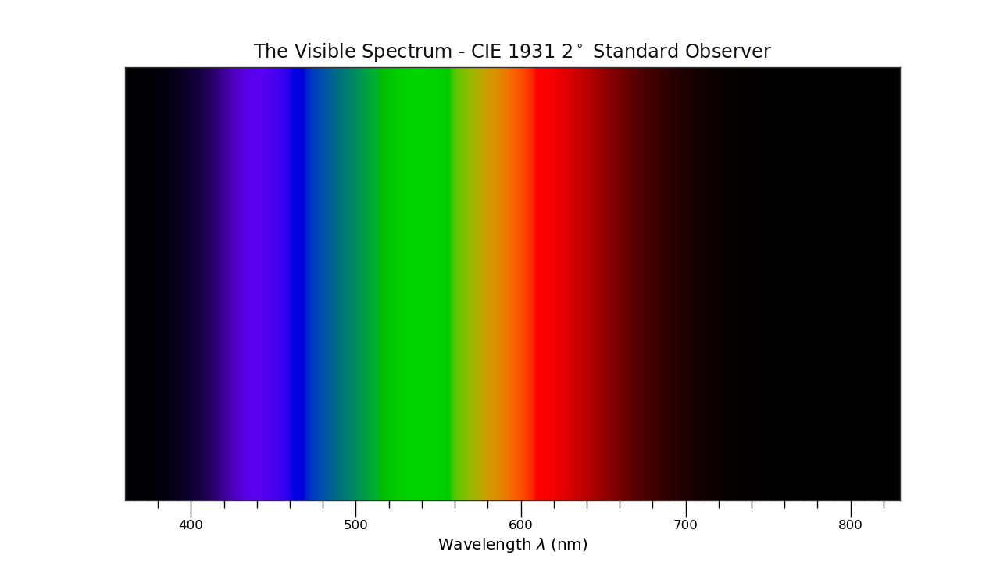
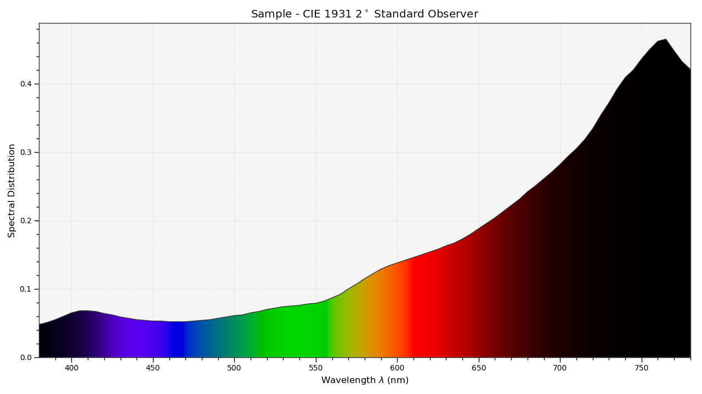
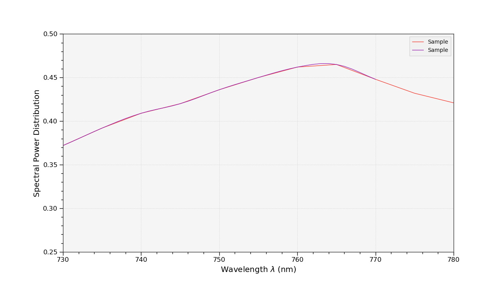
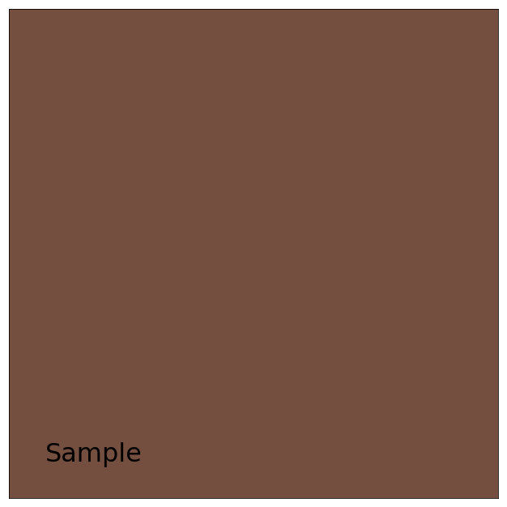
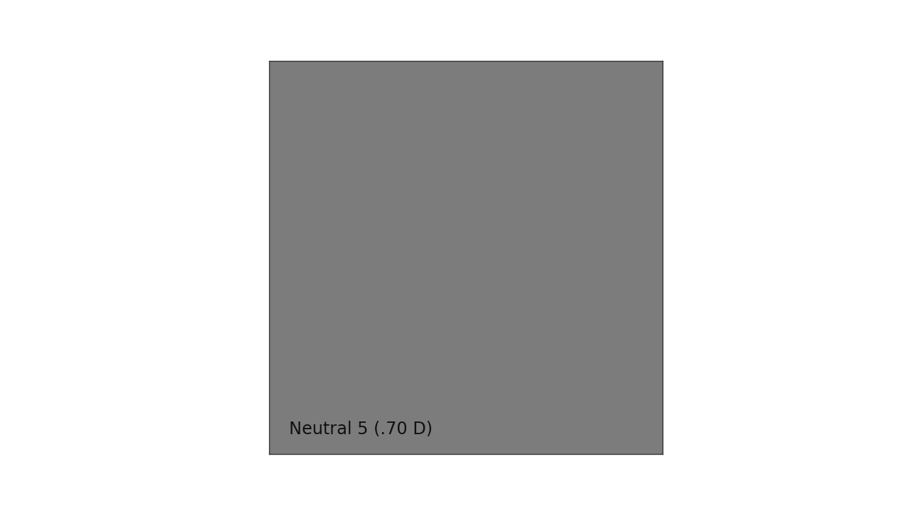
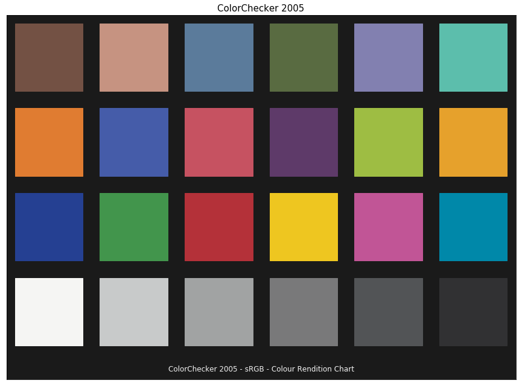

Tutorial
========

.. note::

    An interactive version of the tutorial is available via
    `Google Colab <https://colab.research.google.com/notebook#fileId=1Im9J7or9qyClQCv5sPHmKdyiQbG4898K&offline=true&sandboxMode=true>`__.

`Colour <https://github.com/colour-science/Colour>`__ spreads over
various domains of Colour Science, from colour models to optical
phenomena, this tutorial does not give a complete overview of the
API but is a good introduction to the main concepts.

.. note::

    A directory with examples is available at this path in **Colour**
    installation: *colour/examples*. It can also be explored directly on
    `Github <https://github.com/colour-science/colour/tree/master/colour/examples>`__.

.. code:: python

    from colour.plotting import *

    colour_style()

    plot_visible_spectrum()

Overview
--------

**Colour** is organised around various sub-packages:

-   :doc:`adaptation <colour.adaptation>`: Chromatic adaptation models and
    transformations.
-   :doc:`algebra <colour.algebra>`: Algebra utilities.
-   :doc:`appearance <colour.appearance>`: Colour appearance models.
-   :doc:`biochemistry <colour.biochemistry>`: Biochemistry computations.
-   :doc:`blindness <colour.blindness>`: Colour vision deficiency models.
-   :doc:`characterisation <colour.characterisation>`: Colour correction,
    camera and display characterisation.
-   :doc:`colorimetry <colour.colorimetry>`: Core objects for colour
    computations.
-   :doc:`constants <colour.constants>`: *CIE* and *CODATA* constants.
-   :doc:`continuous <colour.continuous>`: Base objects for continuous data
    representation.
-   :doc:`contrast <colour.contrast>`: Objects for contrast sensitivity
    computation.
-   :doc:`corresponding <colour.corresponding>`: Corresponding colour
    chromaticities computations.
-   :doc:`difference <colour.difference>`: Colour difference computations.
-   :doc:`geometry <colour.geometry>`: Geometry primitives generation.
-   :doc:`graph <colour.graph>`: Graph for automatic colour conversions.
-   :doc:`hints <colour.hints>`: Type hints for annotations.
-   :doc:`io <colour.io>`: Input / output objects for reading and writing data.
-   :doc:`models <colour.models>`: Colour models.
-   :doc:`notation <colour.notation>`: Colour notation systems.
-   :doc:`phenomena <colour.phenomena>`: Computation of various optical
    phenomena.
-   :doc:`plotting <colour.plotting>`: Diagrams, figures, etc...
-   :doc:`quality <colour.quality>`: Colour quality computation.
-   :doc:`recovery <colour.recovery>`: Reflectance recovery.
-   :doc:`temperature <colour.temperature>`: Colour temperature and correlated
    colour temperature computation.
-   :doc:`utilities <colour.utilities>`: Various utilities and data structures.
-   :doc:`volume <colour.volume>`: Colourspace volumes computation and optimal
    colour stimuli.

Most of the public API is available from the root ``colour`` namespace:

.. code:: python

    import colour

    print(colour.__all__[:5] + ["..."])

.. code-block:: text

    ['domain_range_scale', 'get_domain_range_scale', 'set_domain_range_scale', 'CHROMATIC_ADAPTATION_METHODS', 'CHROMATIC_ADAPTATION_TRANSFORMS', '...']

The various sub-packages also expose their public API:

.. code:: python

    from pprint import pprint

    for sub_package in (
        "adaptation",
        "algebra",
        "appearance",
        "biochemistry",
        "blindness",
        "characterisation",
        "colorimetry",
        "constants",
        "continuous",
        "contrast",
        "corresponding",
        "difference",
        "geometry",
        "graph",
        "hints",
        "io",
        "models",
        "notation",
        "phenomena",
        "plotting",
        "quality",
        "recovery",
        "temperature",
        "utilities",
        "volume",
    ):
        print(sub_package.title())
        pprint(getattr(colour, sub_package).__all__[:5] + ["..."])
        print("\n")

.. code-block:: text

    Adaptation
    ['CHROMATIC_ADAPTATION_TRANSFORMS',
     'CAT_BIANCO2010',
     'CAT_BRADFORD',
     'CAT_CAT02',
     'CAT_CAT02_BRILL2008',
     '...']

    Algebra
    ['get_sdiv_mode',
     'set_sdiv_mode',
     'sdiv_mode',
     'sdiv',
     'is_spow_enabled',
     '...']

    Appearance
    ['InductionFactors_Hunt',
     'VIEWING_CONDITIONS_HUNT',
     'CAM_Specification_Hunt',
     'XYZ_to_Hunt',
     'CAM_Specification_ATD95',
     '...']

    Biochemistry
    ['REACTION_RATE_MICHAELISMENTEN_METHODS',
     'reaction_rate_MichaelisMenten',
     'SUBSTRATE_CONCENTRATION_MICHAELISMENTEN_METHODS',
     'substrate_concentration_MichaelisMenten',
     'reaction_rate_MichaelisMenten_Michaelis1913',
     '...']

    Blindness
    ['CVD_MATRICES_MACHADO2010',
     'msds_cmfs_anomalous_trichromacy_Machado2009',
     'matrix_anomalous_trichromacy_Machado2009',
     'matrix_cvd_Machado2009',
     '...']

    Characterisation
    ['RGB_CameraSensitivities',
     'RGB_DisplayPrimaries',
     'MSDS_ACES_RICD',
     'MSDS_CAMERA_SENSITIVITIES',
     'CCS_COLOURCHECKERS',
     '...']

    Colorimetry
    ['SpectralShape',
     'SPECTRAL_SHAPE_DEFAULT',
     'SpectralDistribution',
     'MultiSpectralDistributions',
     'reshape_sd',
     '...']

    Constants
    ['CONSTANT_K_M',
     'CONSTANT_KP_M',
     'CONSTANT_AVOGADRO',
     'CONSTANT_BOLTZMANN',
     'CONSTANT_LIGHT_SPEED',
     '...']

    Continuous
    ['AbstractContinuousFunction', 'Signal', 'MultiSignals', '...']

    Contrast
    ['optical_MTF_Barten1999',
     'pupil_diameter_Barten1999',
     'sigma_Barten1999',
     'retinal_illuminance_Barten1999',
     'maximum_angular_size_Barten1999',
     '...']

    Corresponding
    ['BRENEMAN_EXPERIMENTS',
     'BRENEMAN_EXPERIMENT_PRIMARIES_CHROMATICITIES',
     'CorrespondingColourDataset',
     'CorrespondingChromaticitiesPrediction',
     'corresponding_chromaticities_prediction_CIE1994',
     '...']

    Difference
    ['delta_E_CAM02LCD',
     'delta_E_CAM02SCD',
     'delta_E_CAM02UCS',
     'delta_E_CAM16LCD',
     'delta_E_CAM16SCD',
     '...']

    Geometry
    ['ellipse_coefficients_general_form',
     'ellipse_coefficients_canonical_form',
     'point_at_angle_on_ellipse',
     'ellipse_fitting_Halir1998',
     'ELLIPSE_FITTING_METHODS',
     '...']

    Graph
    ['CONVERSION_GRAPH',
     'CONVERSION_GRAPH_NODE_LABELS',
     'describe_conversion_path',
     'convert',
     '...']

    Hints
    ['ArrayLike', 'NDArray', 'ModuleType', 'Any', 'Callable', '...']

    Io
    ['LUT1D',
     'LUT3x1D',
     'LUT3D',
     'LUT_to_LUT',
     'AbstractLUTSequenceOperator',
     '...']

    Models
    ['COLOURSPACE_MODELS',
     'COLOURSPACE_MODELS_AXIS_LABELS',
     'COLOURSPACE_MODELS_DOMAIN_RANGE_SCALE_1_TO_REFERENCE',
     'Jab_to_JCh',
     'JCh_to_Jab',
     '...']

    Notation
    ['CSS_COLOR_3_BASIC',
     'CSS_COLOR_3_EXTENDED',
     'CSS_COLOR_3',
     'MUNSELL_COLOURS_ALL',
     'MUNSELL_COLOURS_1929',
     '...']

    Phenomena
    ['scattering_cross_section',
     'rayleigh_optical_depth',
     'rayleigh_scattering',
     'sd_rayleigh_scattering',
     '...']

    Plotting
    ['SD_ASTMG173_ETR',
     'SD_ASTMG173_GLOBAL_TILT',
     'SD_ASTMG173_DIRECT_CIRCUMSOLAR',
     'CONSTANTS_COLOUR_STYLE',
     'CONSTANTS_ARROW_STYLE',
     '...']

    Quality
    ['SDS_TCS',
     'SDS_VS',
     'ColourRendering_Specification_CIE2017',
     'colour_fidelity_index_CIE2017',
     'ColourQuality_Specification_ANSIIESTM3018',
     '...']

    Recovery
    ['SPECTRAL_SHAPE_BASIS_FUNCTIONS_DYER2017',
     'BASIS_FUNCTIONS_DYER2017',
     'SPECTRAL_SHAPE_sRGB_MALLETT2019',
     'MSDS_BASIS_FUNCTIONS_sRGB_MALLETT2019',
     'SPECTRAL_SHAPE_OTSU2018',
     '...']

    Temperature
    ['xy_to_CCT_CIE_D',
     'CCT_to_xy_CIE_D',
     'xy_to_CCT_Hernandez1999',
     'CCT_to_xy_Hernandez1999',
     'xy_to_CCT_Kang2002',
     '...']

    Utilities
    ['Lookup',
     'Structure',
     'CanonicalMapping',
     'LazyCanonicalMapping',
     'Node',
     '...']

    Volume
    ['OPTIMAL_COLOUR_STIMULI_ILLUMINANTS',
     'is_within_macadam_limits',
     'is_within_mesh_volume',
     'is_within_pointer_gamut',
     'generate_pulse_waves',
     '...']

The codebase is documented and most docstrings have usage examples:

.. code:: python

    print(colour.temperature.CCT_to_uv_Ohno2013.__doc__)

.. code-block:: text

    Return the *CIE UCS* colourspace *uv* chromaticity coordinates from given
    correlated colour temperature :math:`T_{cp}`, :math:`\Delta_{uv}` and
    colour matching functions using *Ohno (2013)* method.

    Parameters
    ----------
    CCT_D_uv
        Correlated colour temperature :math:`T_{cp}`, :math:`\Delta_{uv}`.
    cmfs
        Standard observer colour matching functions, default to the
        *CIE 1931 2 Degree Standard Observer*.

    Returns
    -------
    :class:`numpy.ndarray`
        *CIE UCS* colourspace *uv* chromaticity coordinates.

    References
    ----------
    :cite:`Ohno2014a`

    Examples
    --------
    from colour import MSDS_CMFS, SPECTRAL_SHAPE_DEFAULT
    cmfs = (
        MSDS_CMFS["CIE 1931 2 Degree Standard Observer"]
        .copy()
        .align(SPECTRAL_SHAPE_DEFAULT)
    )
    CCT_D_uv = np.array([6507.4342201047066, 0.003223690901513])
    CCT_to_uv_Ohno2013(CCT_D_uv, cmfs)  # doctest: +ELLIPSIS
    array([ 0.1977999...,  0.3122004...])

At the core of **Colour** is the ``colour.colorimetry`` sub-package, it defines
the objects needed for spectral computations and many others:

.. code:: python

    pprint(colour.colorimetry.__all__)

.. code-block:: text

    ['SpectralShape',
     'SPECTRAL_SHAPE_DEFAULT',
     'SpectralDistribution',
     'MultiSpectralDistributions',
     'reshape_sd',
     'reshape_msds',
     'sds_and_msds_to_sds',
     'sds_and_msds_to_msds',
     'planck_law',
     'blackbody_spectral_radiance',
     'sd_blackbody',
     'rayleigh_jeans_law',
     'sd_rayleigh_jeans',
     'LMS_ConeFundamentals',
     'RGB_ColourMatchingFunctions',
     'XYZ_ColourMatchingFunctions',
     'CCS_ILLUMINANTS',
     'MSDS_CMFS',
     'MSDS_CMFS_LMS',
     'MSDS_CMFS_RGB',
     'MSDS_CMFS_STANDARD_OBSERVER',
     'SDS_BASIS_FUNCTIONS_CIE_ILLUMINANT_D_SERIES',
     'SDS_ILLUMINANTS',
     'SDS_LEFS',
     'SDS_LEFS_PHOTOPIC',
     'SDS_LEFS_SCOTOPIC',
     'TVS_ILLUMINANTS',
     'TVS_ILLUMINANTS_HUNTERLAB',
     'CCS_LIGHT_SOURCES',
     'SDS_LIGHT_SOURCES',
     'sd_constant',
     'sd_zeros',
     'sd_ones',
     'msds_constant',
     'msds_zeros',
     'msds_ones',
     'SD_GAUSSIAN_METHODS',
     'sd_gaussian',
     'sd_gaussian_normal',
     'sd_gaussian_fwhm',
     'SD_SINGLE_LED_METHODS',
     'sd_single_led',
     'sd_single_led_Ohno2005',
     'SD_MULTI_LEDS_METHODS',
     'sd_multi_leds',
     'sd_multi_leds_Ohno2005',
     'SD_TO_XYZ_METHODS',
     'MSDS_TO_XYZ_METHODS',
     'sd_to_XYZ',
     'msds_to_XYZ',
     'SPECTRAL_SHAPE_ASTME308',
     'handle_spectral_arguments',
     'lagrange_coefficients_ASTME2022',
     'tristimulus_weighting_factors_ASTME2022',
     'adjust_tristimulus_weighting_factors_ASTME308',
     'sd_to_XYZ_integration',
     'sd_to_XYZ_tristimulus_weighting_factors_ASTME308',
     'sd_to_XYZ_ASTME308',
     'msds_to_XYZ_integration',
     'msds_to_XYZ_ASTME308',
     'wavelength_to_XYZ',
     'spectral_uniformity',
     'BANDPASS_CORRECTION_METHODS',
     'bandpass_correction',
     'bandpass_correction_Stearns1988',
     'sd_CIE_standard_illuminant_A',
     'sd_CIE_illuminant_D_series',
     'daylight_locus_function',
     'sd_mesopic_luminous_efficiency_function',
     'mesopic_weighting_function',
     'LIGHTNESS_METHODS',
     'lightness',
     'lightness_Glasser1958',
     'lightness_Wyszecki1963',
     'lightness_CIE1976',
     'lightness_Fairchild2010',
     'lightness_Fairchild2011',
     'lightness_Abebe2017',
     'intermediate_lightness_function_CIE1976',
     'LUMINANCE_METHODS',
     'luminance',
     'luminance_Newhall1943',
     'luminance_ASTMD1535',
     'luminance_CIE1976',
     'luminance_Fairchild2010',
     'luminance_Fairchild2011',
     'luminance_Abebe2017',
     'intermediate_luminance_function_CIE1976',
     'dominant_wavelength',
     'complementary_wavelength',
     'excitation_purity',
     'colorimetric_purity',
     'luminous_flux',
     'luminous_efficiency',
     'luminous_efficacy',
     'RGB_10_degree_cmfs_to_LMS_10_degree_cmfs',
     'RGB_2_degree_cmfs_to_XYZ_2_degree_cmfs',
     'RGB_10_degree_cmfs_to_XYZ_10_degree_cmfs',
     'LMS_2_degree_cmfs_to_XYZ_2_degree_cmfs',
     'LMS_10_degree_cmfs_to_XYZ_10_degree_cmfs',
     'WHITENESS_METHODS',
     'whiteness',
     'whiteness_Berger1959',
     'whiteness_Taube1960',
     'whiteness_Stensby1968',
     'whiteness_ASTME313',
     'whiteness_Ganz1979',
     'whiteness_CIE2004',
     'YELLOWNESS_METHODS',
     'yellowness',
     'yellowness_ASTMD1925',
     'yellowness_ASTME313_alternative',
     'YELLOWNESS_COEFFICIENTS_ASTME313',
     'yellowness_ASTME313']

**Colour** computations leverage a comprehensive quantity of datasets available
in most sub-packages, for example the ``colour.colorimetry.datasets`` defines
the following components:

.. code:: python

    pprint(colour.colorimetry.datasets.__all__)

.. code-block:: text

    ['MSDS_CMFS',
     'MSDS_CMFS_LMS',
     'MSDS_CMFS_RGB',
     'MSDS_CMFS_STANDARD_OBSERVER',
     'CCS_ILLUMINANTS',
     'SDS_BASIS_FUNCTIONS_CIE_ILLUMINANT_D_SERIES',
     'TVS_ILLUMINANTS_HUNTERLAB',
     'SDS_ILLUMINANTS',
     'TVS_ILLUMINANTS',
     'CCS_LIGHT_SOURCES',
     'SDS_LIGHT_SOURCES',
     'SDS_LEFS',
     'SDS_LEFS_PHOTOPIC',
     'SDS_LEFS_SCOTOPIC']

From Spectral Distribution
--------------------------

Whether it be a sample spectral distribution, colour matching functions or
illuminants, spectral data is manipulated using an object built with the
``colour.SpectralDistribution`` class or based on it:

.. code:: python

    # Defining a sample spectral distribution data.
    data_sample = {
        380: 0.048,
        385: 0.051,
        390: 0.055,
        395: 0.060,
        400: 0.065,
        405: 0.068,
        410: 0.068,
        415: 0.067,
        420: 0.064,
        425: 0.062,
        430: 0.059,
        435: 0.057,
        440: 0.055,
        445: 0.054,
        450: 0.053,
        455: 0.053,
        460: 0.052,
        465: 0.052,
        470: 0.052,
        475: 0.053,
        480: 0.054,
        485: 0.055,
        490: 0.057,
        495: 0.059,
        500: 0.061,
        505: 0.062,
        510: 0.065,
        515: 0.067,
        520: 0.070,
        525: 0.072,
        530: 0.074,
        535: 0.075,
        540: 0.076,
        545: 0.078,
        550: 0.079,
        555: 0.082,
        560: 0.087,
        565: 0.092,
        570: 0.100,
        575: 0.107,
        580: 0.115,
        585: 0.122,
        590: 0.129,
        595: 0.134,
        600: 0.138,
        605: 0.142,
        610: 0.146,
        615: 0.150,
        620: 0.154,
        625: 0.158,
        630: 0.163,
        635: 0.167,
        640: 0.173,
        645: 0.180,
        650: 0.188,
        655: 0.196,
        660: 0.204,
        665: 0.213,
        670: 0.222,
        675: 0.231,
        680: 0.242,
        685: 0.251,
        690: 0.261,
        695: 0.271,
        700: 0.282,
        705: 0.294,
        710: 0.305,
        715: 0.318,
        720: 0.334,
        725: 0.354,
        730: 0.372,
        735: 0.392,
        740: 0.409,
        745: 0.420,
        750: 0.436,
        755: 0.450,
        760: 0.462,
        765: 0.465,
        770: 0.448,
        775: 0.432,
        780: 0.421,
    }

    sd = colour.SpectralDistribution(data_sample, name="Sample")
    print(repr(sd))

.. code-block:: text

    SpectralDistribution([[  3.80000000e+02,   4.80000000e-02],
                          [  3.85000000e+02,   5.10000000e-02],
                          [  3.90000000e+02,   5.50000000e-02],
                          [  3.95000000e+02,   6.00000000e-02],
                          [  4.00000000e+02,   6.50000000e-02],
                          [  4.05000000e+02,   6.80000000e-02],
                          [  4.10000000e+02,   6.80000000e-02],
                          [  4.15000000e+02,   6.70000000e-02],
                          [  4.20000000e+02,   6.40000000e-02],
                          [  4.25000000e+02,   6.20000000e-02],
                          [  4.30000000e+02,   5.90000000e-02],
                          [  4.35000000e+02,   5.70000000e-02],
                          [  4.40000000e+02,   5.50000000e-02],
                          [  4.45000000e+02,   5.40000000e-02],
                          [  4.50000000e+02,   5.30000000e-02],
                          [  4.55000000e+02,   5.30000000e-02],
                          [  4.60000000e+02,   5.20000000e-02],
                          [  4.65000000e+02,   5.20000000e-02],
                          [  4.70000000e+02,   5.20000000e-02],
                          [  4.75000000e+02,   5.30000000e-02],
                          [  4.80000000e+02,   5.40000000e-02],
                          [  4.85000000e+02,   5.50000000e-02],
                          [  4.90000000e+02,   5.70000000e-02],
                          [  4.95000000e+02,   5.90000000e-02],
                          [  5.00000000e+02,   6.10000000e-02],
                          [  5.05000000e+02,   6.20000000e-02],
                          [  5.10000000e+02,   6.50000000e-02],
                          [  5.15000000e+02,   6.70000000e-02],
                          [  5.20000000e+02,   7.00000000e-02],
                          [  5.25000000e+02,   7.20000000e-02],
                          [  5.30000000e+02,   7.40000000e-02],
                          [  5.35000000e+02,   7.50000000e-02],
                          [  5.40000000e+02,   7.60000000e-02],
                          [  5.45000000e+02,   7.80000000e-02],
                          [  5.50000000e+02,   7.90000000e-02],
                          [  5.55000000e+02,   8.20000000e-02],
                          [  5.60000000e+02,   8.70000000e-02],
                          [  5.65000000e+02,   9.20000000e-02],
                          [  5.70000000e+02,   1.00000000e-01],
                          [  5.75000000e+02,   1.07000000e-01],
                          [  5.80000000e+02,   1.15000000e-01],
                          [  5.85000000e+02,   1.22000000e-01],
                          [  5.90000000e+02,   1.29000000e-01],
                          [  5.95000000e+02,   1.34000000e-01],
                          [  6.00000000e+02,   1.38000000e-01],
                          [  6.05000000e+02,   1.42000000e-01],
                          [  6.10000000e+02,   1.46000000e-01],
                          [  6.15000000e+02,   1.50000000e-01],
                          [  6.20000000e+02,   1.54000000e-01],
                          [  6.25000000e+02,   1.58000000e-01],
                          [  6.30000000e+02,   1.63000000e-01],
                          [  6.35000000e+02,   1.67000000e-01],
                          [  6.40000000e+02,   1.73000000e-01],
                          [  6.45000000e+02,   1.80000000e-01],
                          [  6.50000000e+02,   1.88000000e-01],
                          [  6.55000000e+02,   1.96000000e-01],
                          [  6.60000000e+02,   2.04000000e-01],
                          [  6.65000000e+02,   2.13000000e-01],
                          [  6.70000000e+02,   2.22000000e-01],
                          [  6.75000000e+02,   2.31000000e-01],
                          [  6.80000000e+02,   2.42000000e-01],
                          [  6.85000000e+02,   2.51000000e-01],
                          [  6.90000000e+02,   2.61000000e-01],
                          [  6.95000000e+02,   2.71000000e-01],
                          [  7.00000000e+02,   2.82000000e-01],
                          [  7.05000000e+02,   2.94000000e-01],
                          [  7.10000000e+02,   3.05000000e-01],
                          [  7.15000000e+02,   3.18000000e-01],
                          [  7.20000000e+02,   3.34000000e-01],
                          [  7.25000000e+02,   3.54000000e-01],
                          [  7.30000000e+02,   3.72000000e-01],
                          [  7.35000000e+02,   3.92000000e-01],
                          [  7.40000000e+02,   4.09000000e-01],
                          [  7.45000000e+02,   4.20000000e-01],
                          [  7.50000000e+02,   4.36000000e-01],
                          [  7.55000000e+02,   4.50000000e-01],
                          [  7.60000000e+02,   4.62000000e-01],
                          [  7.65000000e+02,   4.65000000e-01],
                          [  7.70000000e+02,   4.48000000e-01],
                          [  7.75000000e+02,   4.32000000e-01],
                          [  7.80000000e+02,   4.21000000e-01]],
                         interpolator=SpragueInterpolator,
                         interpolator_args={},
                         extrapolator=Extrapolator,
                         extrapolator_args={u'right': None, u'method': u'Constant', u'left': None})

The sample spectral distribution can be easily plotted against the visible
spectrum:

.. code:: python

    # Plotting the sample spectral distribution.
    plot_single_sd(sd)

With the sample spectral distribution defined, its shape is retrieved as
follows:

.. code:: python

    # Displaying the sample spectral distribution shape.
    print(sd.shape)

.. code-block:: text

    (380.0, 780.0, 5.0)

The returned shape is an instance of the ``colour.SpectralShape`` class:

.. code:: python

    repr(sd.shape)

.. code-block:: text

    'SpectralShape(380.0, 780.0, 5.0)'

The ``colour.SpectralShape`` class is used throughout **Colour** to define
spectral dimensions and is instantiated as follows:

.. code:: python

    # Using *colour.SpectralShape* with iteration.
    shape = colour.SpectralShape(start=0, end=10, interval=1)
    for wavelength in shape:
        print(wavelength)

    # *colour.SpectralShape.wavelengths* property is providing the complete
    # range of wavelengths.
    shape = colour.SpectralShape(0, 10, 0.5)
    shape.wavelengths

.. code-block:: text

    0.0
    1.0
    2.0
    3.0
    4.0
    5.0
    6.0
    7.0
    8.0
    9.0
    10.0

.. code-block:: text

    array([  0. ,   0.5,   1. ,   1.5,   2. ,   2.5,   3. ,   3.5,   4. ,
             4.5,   5. ,   5.5,   6. ,   6.5,   7. ,   7.5,   8. ,   8.5,
             9. ,   9.5,  10. ])

**Colour** defines three convenient objects to create constant spectral
distributions:

-  ``colour.sd_constant``
-  ``colour.sd_zeros``
-  ``colour.sd_ones``

.. code:: python

    # Defining a constant spectral distribution.
    sd_constant = colour.sd_constant(100)
    print('"Constant Spectral Distribution"')
    print(sd_constant.shape)
    print(sd_constant[400])

    # Defining a zeros filled spectral distribution.
    print('\n"Zeros Filled Spectral Distribution"')
    sd_zeros = colour.sd_zeros()
    print(sd_zeros.shape)
    print(sd_zeros[400])

    # Defining a ones filled spectral distribution.
    print('\n"Ones Filled Spectral Distribution"')
    sd_ones = colour.sd_ones()
    print(sd_ones.shape)
    print(sd_ones[400])

.. code-block:: text

    "Constant Spectral Distribution"
    (360.0, 780.0, 1.0)
    100.0

    "Zeros Filled Spectral Distribution"
    (360.0, 780.0, 1.0)
    0.0

    "Ones Filled Spectral Distribution"
    (360.0, 780.0, 1.0)
    1.0

By default the shape used by ``colour.sd_constant``,
``colour.sd_zeros`` and ``colour.sd_ones`` is the one defined by the
``colour.SPECTRAL_SHAPE_DEFAULT`` attribute and based on *ASTM E308-15*
practise shape.

.. code:: python

    print(repr(colour.SPECTRAL_SHAPE_DEFAULT))

.. code-block:: text

    SpectralShape(360, 780, 1)

A custom shape can be passed to construct a constant spectral distribution
with user defined dimensions:

.. code:: python

    colour.sd_ones(colour.SpectralShape(400, 700, 5))[450]

.. code-block:: text

    1.0

The ``colour.SpectralDistribution`` class supports the following
arithmetical operations:

-   *addition*
-   *subtraction*
-   *multiplication*
-   *division*
-   *exponentiation*

.. code:: python

    sd1 = colour.sd_ones()
    print('"Ones Filled Spectral Distribution"')
    print(sd1[400])

    print('\n"x2 Constant Multiplied"')
    print((sd1 * 2)[400])

    print('\n"+ Spectral Distribution"')
    print((sd1 + colour.sd_ones())[400])

.. code-block:: text

    "Ones Filled Spectral Distribution"
    1.0

    "x2 Constant Multiplied"
    2.0

    "+ Spectral Distribution"
    2.0

Often interpolation of the spectral distribution is required, this is achieved
with the ``colour.SpectralDistribution.interpolate`` method. Depending on the
wavelengths uniformity, the default interpolation method will differ.
Following *CIE 167:2005* recommendation: The method developed by
*Sprague (1880)* should be used for interpolating functions having a uniformly
spaced independent variable and a *Cubic Spline* method for non-uniformly spaced
independent variable  :cite:`CIETC1-382005e`.

The uniformity of the sample spectral distribution is assessed as follows:

.. code:: python

    # Checking the sample spectral distribution uniformity.
    print(sd.is_uniform())

.. code-block:: text

    True

In this case, since the sample spectral distribution is uniform the
interpolation defaults to the ``colour.SpragueInterpolator`` interpolator.

.. note::

    Interpolation happens in place and may alter the original data, use the
    ``colour.SpectralDistribution.copy`` method to generate a copy of the
    spectral distribution before interpolation.

.. code:: python

    # Copying the sample spectral distribution.
    sd_copy = sd.copy()

    # Interpolating the copied sample spectral distribution.
    sd_copy.interpolate(colour.SpectralShape(400, 770, 1))
    sd_copy[401]

.. code-block:: text

    0.065809599999999996

.. code:: python

    # Comparing the interpolated spectral distribution with the original one.
    plot_multi_sds([sd, sd_copy], bounding_box=[730, 780, 0.25, 0.5])

Extrapolation although dangerous can be used to help aligning two spectral
distributions together. *CIE publication CIE 15:2004 “Colorimetry”* recommends
that unmeasured values may be set equal to the nearest measured value of the
appropriate quantity in truncation :cite:`CIETC1-482004h`:

.. code:: python

    # Extrapolating the copied sample spectral distribution.
    sd_copy.extrapolate(colour.SpectralShape(340, 830, 1))
    sd_copy[340], sd_copy[830]

.. code-block:: text

    (0.065000000000000002, 0.44800000000000018)

The underlying interpolator can be swapped for any of the **Colour**
interpolators:

.. code:: python

    pprint(
        [
            export
            for export in colour.algebra.interpolation.__all__
            if "Interpolator" in export
        ]
    )

.. code-block:: text

    [u'KernelInterpolator',
     u'LinearInterpolator',
     u'SpragueInterpolator',
     u'CubicSplineInterpolator',
     u'PchipInterpolator',
     u'NullInterpolator']

.. code:: python

    # Changing interpolator while trimming the copied spectral distribution.
    sd_copy.interpolate(
        colour.SpectralShape(400, 700, 10),
        interpolator=colour.LinearInterpolator,
    )

.. code-block:: text

    SpectralDistribution([[  4.00000000e+02,   6.50000000e-02],
                          [  4.10000000e+02,   6.80000000e-02],
                          [  4.20000000e+02,   6.40000000e-02],
                          [  4.30000000e+02,   5.90000000e-02],
                          [  4.40000000e+02,   5.50000000e-02],
                          [  4.50000000e+02,   5.30000000e-02],
                          [  4.60000000e+02,   5.20000000e-02],
                          [  4.70000000e+02,   5.20000000e-02],
                          [  4.80000000e+02,   5.40000000e-02],
                          [  4.90000000e+02,   5.70000000e-02],
                          [  5.00000000e+02,   6.10000000e-02],
                          [  5.10000000e+02,   6.50000000e-02],
                          [  5.20000000e+02,   7.00000000e-02],
                          [  5.30000000e+02,   7.40000000e-02],
                          [  5.40000000e+02,   7.60000000e-02],
                          [  5.50000000e+02,   7.90000000e-02],
                          [  5.60000000e+02,   8.70000000e-02],
                          [  5.70000000e+02,   1.00000000e-01],
                          [  5.80000000e+02,   1.15000000e-01],
                          [  5.90000000e+02,   1.29000000e-01],
                          [  6.00000000e+02,   1.38000000e-01],
                          [  6.10000000e+02,   1.46000000e-01],
                          [  6.20000000e+02,   1.54000000e-01],
                          [  6.30000000e+02,   1.63000000e-01],
                          [  6.40000000e+02,   1.73000000e-01],
                          [  6.50000000e+02,   1.88000000e-01],
                          [  6.60000000e+02,   2.04000000e-01],
                          [  6.70000000e+02,   2.22000000e-01],
                          [  6.80000000e+02,   2.42000000e-01],
                          [  6.90000000e+02,   2.61000000e-01],
                          [  7.00000000e+02,   2.82000000e-01]],
                         interpolator=SpragueInterpolator,
                         interpolator_args={},
                         extrapolator=Extrapolator,
                         extrapolator_args={u'right': None, u'method': u'Constant', u'left': None})

The extrapolation behaviour can be changed for ``Linear`` method instead
of the ``Constant`` default method or even use arbitrary constant ``left``
and ``right`` values:

.. code:: python

    # Extrapolating the copied sample spectral distribution with *Linear* method.
    sd_copy.extrapolate(
        colour.SpectralShape(340, 830, 1),
        extrapolator_kwargs={"method": "Linear", "right": 0},
    )
    sd_copy[340], sd_copy[830]

.. code-block:: text

    (0.046999999999999348, 0.0)

Aligning a spectral distribution is a convenient way to first interpolates the
current data within its original bounds, then, if required, extrapolate any
missing values to match the requested shape:

.. code:: python

    # Aligning the cloned sample spectral distribution.
    # The spectral distribution is first trimmed as above.
    sd_copy.interpolate(colour.SpectralShape(400, 700, 1))
    sd_copy.align(colour.SpectralShape(340, 830, 5))
    sd_copy[340], sd_copy[830]

.. code-block:: text

    (0.065000000000000002, 0.28199999999999975)

The ``colour.SpectralDistribution`` class also supports various arithmetic
operations like *addition*, *subtraction*, *multiplication*, *division* or
*exponentiation* with *numeric* and *array_like* variables or other
``colour.SpectralDistribution`` class instances:

.. code:: python

    sd = colour.SpectralDistribution(
        {
            410: 0.25,
            420: 0.50,
            430: 0.75,
            440: 1.0,
            450: 0.75,
            460: 0.50,
            480: 0.25,
        }
    )

    print((sd.copy() + 1).values)
    print((sd.copy() * 2).values)
    print((sd * [0.35, 1.55, 0.75, 2.55, 0.95, 0.65, 0.15]).values)
    print((sd * colour.sd_constant(2, sd.shape) * colour.sd_constant(3, sd.shape)).values)

.. code-block:: text

    [ 1.25  1.5   1.75  2.    1.75  1.5   1.25]
    [ 0.5  1.   1.5  2.   1.5  1.   0.5]
    [ 0.0875  0.775   0.5625  2.55    0.7125  0.325   0.0375]
    [ 1.5  3.   4.5  6.   4.5  3.   1.5]

The spectral distribution can be normalised with an arbitrary factor:

.. code:: python

    print(sd.normalise().values)
    print(sd.normalise(100).values)

.. code-block:: text

    [ 0.25  0.5   0.75  1.    0.75  0.5   0.25]
    [  25.   50.   75.  100.   75.   50.   25.]

A the heart of the ``colour.SpectralDistribution`` class is the
``colour.continuous.Signal`` class which implements the
``colour.continuous.Signal.function`` method.

Evaluating the function for any independent domain
:math:`x \in \mathbb{R}` variable returns a corresponding range
:math:`y \in \mathbb{R}` variable.

It adopts an interpolating function encapsulated inside an extrapolating
function. The resulting function independent domain, stored as discrete
values in the ``colour.continuous.Signal.domain`` attribute corresponds
with the function dependent and already known range stored in the
``colour.continuous.Signal.range`` attribute.

Describing the ``colour.continuous.Signal`` class is beyond the scope of
this tutorial but the core capability can be described.

.. code:: python

    import numpy as np

    range_ = np.linspace(10, 100, 10)
    signal = colour.continuous.Signal(range_)
    print(repr(signal))

.. code-block:: text

    Signal([[   0.,   10.],
            [   1.,   20.],
            [   2.,   30.],
            [   3.,   40.],
            [   4.,   50.],
            [   5.,   60.],
            [   6.,   70.],
            [   7.,   80.],
            [   8.,   90.],
            [   9.,  100.]],
           interpolator=KernelInterpolator,
           interpolator_kwargs={},
           extrapolator=Extrapolator,
           extrapolator_kwargs={u'right': nan, u'method': u'Constant', u'left': nan})

.. code:: python

    # Returning the corresponding range *y* variable for any arbitrary independent domain *x* variable.
    signal[np.random.uniform(0, 9, 10)]

.. code-block:: text

    array([ 94.74700025,  50.62829102,  72.93120155,  81.86179968,
            70.14736394,  83.11336665,  51.17649751,  71.00638621,
            86.94761009,  78.01845818])

Convert to Tristimulus Values
-----------------------------

From a given spectral distribution, *CIE XYZ* tristimulus values can be
calculated:

.. code:: python

    sd = colour.SpectralDistribution(data_sample)
    cmfs = colour.MSDS_CMFS["CIE 1931 2 Degree Standard Observer"]
    illuminant = colour.SDS_ILLUMINANTS["D65"]

    # Calculating the sample spectral distribution *CIE XYZ* tristimulus values.
    XYZ = colour.sd_to_XYZ(sd, cmfs, illuminant)
    print(XYZ)

.. code-block:: text

    [ 10.97085572   9.70278591   6.05562778]

From *CIE XYZ* Colourspace
--------------------------

*CIE XYZ* is the central colourspace for Colour Science from which many
computations are available, expanding to even more computations:

.. code:: python

    # Displaying objects interacting directly with the *CIE XYZ* colourspace.
    pprint(colour.COLOURSPACE_MODELS)

.. code-block:: text

    ('CAM02LCD',
     'CAM02SCD',
     'CAM02UCS',
     'CAM16LCD',
     'CAM16SCD',
     'CAM16UCS',
     'CIE XYZ',
     'CIE xyY',
     'CIE Lab',
     'CIE Luv',
     'CIE UCS',
     'CIE UVW',
     'DIN99',
     'Hunter Lab',
     'Hunter Rdab',
     'ICaCb',
     'ICtCp',
     'IPT',
     'IPT Ragoo 2021',
     'IgPgTg',
     'Jzazbz',
     'OSA UCS',
     'Oklab',
     'hdr-CIELAB',
     'hdr-IPT',
     'Yrg')

Convert to Display Colours
--------------------------

*CIE XYZ* tristimulus values can be converted into *sRGB* colourspace *RGB*
values in order to display them on screen:

.. code:: python

    # The output domain of *colour.sd_to_XYZ* is [0, 100] and the input
    # domain of *colour.XYZ_to_sRGB* is [0, 1]. It needs to be accounted for,
    # thus the input *CIE XYZ* tristimulus values are scaled.
    RGB = colour.XYZ_to_sRGB(XYZ / 100)
    print(RGB)

.. code-block:: text

    [ 0.45675795  0.30986982  0.24861924]

.. code:: python

    # Plotting the *sRGB* colourspace colour of the *Sample* spectral distribution.
    plot_single_colour_swatch(ColourSwatch(RGB, "Sample"), text_kwargs={"size": "x-large"})

Generate Colour Rendition Charts
--------------------------------

Likewise, colour values from a colour rendition chart sample can be computed.

.. note::

    This is useful for render time checks in the VFX industry,
    where a synthetic colour chart can be inserted into a render to
    ensure the colour management is acting as expected.

The ``colour.characterisation`` sub-package contains the dataset for
various colour rendition charts:

.. code:: python

    # Colour rendition charts chromaticity coordinates.
    print(sorted(colour.characterisation.CCS_COLOURCHECKERS.keys()))

    # Colour rendition charts spectral distributions.
    print(sorted(colour.characterisation.SDS_COLOURCHECKERS.keys()))

.. code-block:: text

    ['BabelColor Average', 'ColorChecker 1976', 'ColorChecker 2005', 'ColorChecker24 - After November 2014', 'ColorChecker24 - Before November 2014', 'TE226 V2', 'babel_average', 'cc2005', 'cca2014', 'ccb2014']
    ['BabelColor Average', 'ColorChecker N Ohta', 'ISO 17321-1', 'babel_average', 'cc_ohta']

.. note::

    The above ``cc2005``, ``babel_average`` and ``cc_ohta`` keys are
    convenient aliases for respectively ``ColorChecker 2005``, ``BabelColor Average``
    and ``ColorChecker N Ohta`` keys.

.. code:: python

    # Plotting the *sRGB* colourspace colour of *neutral 5 (.70 D)* patch.
    patch_name = "neutral 5 (.70 D)"
    patch_sd = colour.SDS_COLOURCHECKERS["ColorChecker N Ohta"][patch_name]
    XYZ = colour.sd_to_XYZ(patch_sd, cmfs, illuminant)
    RGB = colour.XYZ_to_sRGB(XYZ / 100)

    plot_single_colour_swatch(
        ColourSwatch(RGB, patch_name.title()), text_kwargs={"size": "x-large"}
    )

**Colour** defines a convenient plotting object to draw synthetic colour
rendition charts figures:

.. code:: python

    plot_single_colour_checker(
        colour_checker="ColorChecker 2005", text_kwargs={"visible": False}
    )

Convert to Chromaticity Coordinates
-----------------------------------

Given a spectral distribution, chromaticity coordinates *CIE xy* can be computed
using the ``colour.XYZ_to_xy`` definition:

.. code:: python

    # Computing *CIE xy* chromaticity coordinates for the *neutral 5 (.70 D)* patch.
    xy = colour.XYZ_to_xy(XYZ)
    print(xy)

.. code-block:: text

    [ 0.31259787  0.32870029]

Chromaticity coordinates *CIE xy* can be plotted into the *CIE 1931 Chromaticity Diagram*:

.. code:: python

    import matplotlib.pyplot as plt

    # Plotting the *CIE 1931 Chromaticity Diagram*.
    # The argument *show=False* is passed so that the plot doesn't get
    # displayed and can be used as a basis for other plots.
    plot_chromaticity_diagram_CIE1931(show=False)

    # Plotting the *CIE xy* chromaticity coordinates.
    x, y = xy
    plt.plot(x, y, "o-", color="white")

    # Annotating the plot.
    plt.annotate(
        patch_sd.name.title(),
        xy=xy,
        xytext=(-50, 30),
        textcoords="offset points",
        arrowprops=dict(arrowstyle="->", connectionstyle="arc3, rad=-0.2"),
    )

    # Displaying the plot.
    render(
        show=True,
        limits=(-0.1, 0.9, -0.1, 0.9),
        x_tighten=True,
        y_tighten=True,
    )

.. image:: _static/Tutorial_CIE_1931_Chromaticity_Diagram.png

See More
--------

-   The :doc:`basics` page puts an emphasis on basic but important to
    understand concepts of **Colour**.
-   The :doc:`advanced` page describes some advanced usage scenarios of
    **Colour**.
-   The `Google Colab How-To <https://colab.research.google.com/notebook#fileId=1NRcdXSCshivkwoU2nieCvC3y14fx1X4X&offline=true&sandboxMode=true>`__
    guide for **Colour** shows various techniques to solve specific problems
    and highlights some interesting use cases.
